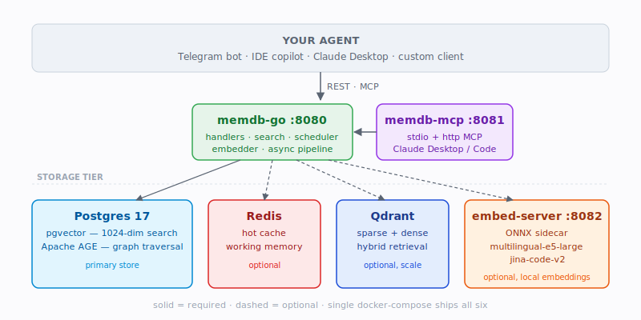
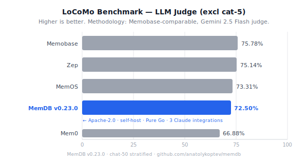

<div align="center">

# MemDB

**Self-hosted long-term memory database for AI agents.**
**One docker-compose. Pure Go.**

[](https://opensource.org/license/apache-2-0/)
[](https://github.com/anatolykoptev/memdb/releases)
[](evaluation/locomo/MILESTONES.md)
[](https://go.dev/)
[](https://github.com/anatolykoptev/memdb/stargazers)
[](https://discord.gg/8vhbTZgf)



<!-- TODO demo: record with asciinema + agg → docs/assets/demo.gif (recipe in docs/assets/README.md) -->
<!--  -->

[**Quick Start**](#quick-start-5-minutes) ·
[**Use Cases**](#use-cases) ·
[**Comparison**](#why-memdb) ·
[**Documentation**](docs/) ·
[**Roadmap**](#roadmap) ·
[**Discord**](https://discord.gg/8vhbTZgf)

</div>

---

## What is MemDB?

MemDB stores, retrieves, and manages long-term memory for AI agents. It runs as a single
`docker compose up` and exposes a REST API plus a built-in MCP server, so Claude-style
agents (Telegram bots, IDE copilots, support agents, personal assistants) can recall facts,
preferences, and prior conversations across sessions.

<p align="center">
  
</p>
<p align="center">
  <em>72.5% LLM Judge on LoCoMo chat-50 stratified — between Mem0 and MemOS, +5.62pp ahead of Mem0. <a href="evaluation/locomo/MILESTONES.md">Methodology</a> · <a href="docs/marketing/competitive-comparison.md">Full comparison</a></em>
</p>

---

## Why MemDB

Honest comparison with comparable open-source memory systems. `?` marks unverified numbers
— please open a PR with a citation if you have current data.

| | **MemDB** | Mem0 | Letta | Zep | Memobase |
|---|---|---|---|---|---|
| Self-hostable | **✅ Yes** (pure Go binary) | ✅ Yes (Python) <!-- TODO verify --> | ✅ Yes (Python) <!-- TODO verify --> | ✅ Yes <!-- TODO verify --> | ✅ Yes <!-- TODO verify --> |
| Single static binary | **✅ Yes** | ❌ No | ❌ No | ❌ No | ❌ No |
| LoCoMo LLM-Judge | **72.5% (excl cat-5, v0.23.0 / M10)** | 66.88% | ~58% `?` | **75.14%** (self-reported) | 75.78% (excl. cat-5) |
| pgvector + AGE graph | **✅ Yes** | ⚠️ Partial `?` | ❌ No | ⚠️ Yes (Neo4j) `?` | ⚠️ Partial `?` |
| MCP server included | **✅ Yes** | ❌ No `?` | ❌ No `?` | ❌ No `?` | ❌ No `?` |
| Local embeddings | **✅ ONNX sidecar** | ❌ No `?` | ❌ No `?` | ❌ No `?` | ❌ No `?` |
| License | **Apache 2.0** | Apache 2.0 `?` | Apache 2.0 `?` | Apache 2.0 `?` | Apache 2.0 `?` |

The `?` marks honest uncertainty, not disparagement. Memobase 75.78% is published in their
LoCoMo harness, excluding adversarial category 5 — see
[MILESTONES.md](evaluation/locomo/MILESTONES.md#two-track-reporting-convention-m9-stream-3)
for why we report two tracks. For the long version — origin story, academic foundation,
MemOS-vs-MemDB divergence — see [docs/overview.md](docs/overview.md) (EN) or
[docs/overview-ru.md](docs/overview-ru.md) (RU).

---

## Use Cases

<table>
<tr>
<td width="50%" valign="top">

### 🤖 Telegram / Discord bot
Remembers user prefs and prior context across sessions. No more "tell me about yourself" cold starts.
[See example →](examples/go/quickstart)

</td>
<td width="50%" valign="top">

### 💻 IDE copilot
Persistent context about the user's stack, naming conventions, and recurring bug patterns. Recall on file open.
[See example →](examples/python/quickstart)

</td>
</tr>
<tr>
<td width="50%" valign="top">

### 🎧 Customer support agent
Recalls a customer's prior issues and account context. They never re-explain. Scope per org with `cube_id`, per customer with `user_id`.
[See example →](examples/mcp/claude-desktop)

</td>
<td width="50%" valign="top">

### 🧠 Personal assistant
"What did I order on Amazon last March?" — long-horizon recall across email, chat, and tool history. Not "I don't have access".
[See example →](examples/python/quickstart)

</td>
</tr>
</table>

<!-- TODO telegram-bot-demo.png: drop bot screenshot here once recorded (see docs/assets/README.md) -->
<!-- <p align="center"></p> -->

Plus **agentic workflows** — persistent skill / trajectory memory: the agent remembers which tools succeeded for which task category and uses that history to plan future runs.

---

## When MemDB is **NOT** the right fit

Trust through limits — pick something else if:

- **You want parametric memory.** MemDB stores explicit memories in Postgres, not weights.
  For baking knowledge into the model itself, use LoRA / QLoRA (axolotl, unsloth).
- **You need multi-modal image / audio memory today.** On the roadmap
  ([docs/backlog/features.md](docs/backlog/features.md)), not shipped. Today: LanceDB or
  a custom CLIP + Qdrant stack.
- **You want a managed cloud.** MemDB is self-hosted only — no `app.memdb.ai` plan yet.
  Mem0 Cloud / Zep Cloud are valid alternatives.
- **You need < 50 ms p99 retrieval at million-memory scale.** The full D1–D11 + rerank
  cascade targets quality, not latency extremes. Pure ANN (Qdrant, Milvus standalone) is
  lower-latency.
- **You only need session-scoped memory.** LangChain `ConversationBufferMemory` is simpler.
  MemDB earns its weight starting from "remember across days / weeks / users".

---

## Quick Start (5 minutes)

```bash
git clone https://github.com/anatolykoptev/memdb && cd memdb
cp .env.example .env
# edit .env: set MEMDB_LLM_API_KEY (any OpenAI-compatible endpoint works)
#            set POSTGRES_PASSWORD (no default — required)
docker compose -f docker/docker-compose.yml up -d
curl http://localhost:8080/health
# {"status":"ok"}
```

Add a memory, then search it back:

```bash
curl -s -X POST http://localhost:8080/product/add -H "Content-Type: application/json" -d '{
  "user_id": "alice", "writable_cube_ids": ["my-cube"],
  "messages": [
    {"role": "user", "content": "I love hiking and prefer concise answers."},
    {"role": "assistant", "content": "Noted."}
  ],
  "async_mode": "sync"
}'

curl -s -X POST http://localhost:8080/product/search -H "Content-Type: application/json" -d '{
  "user_id": "alice", "readable_cube_ids": ["my-cube"],
  "query": "outdoor activities", "top_k": 5, "mode": "fast"
}'
```

Expected response (truncated):

```json
{"memories": [{"id": "...", "memory": "Alice loves hiking and prefers concise answers.",
  "score": 0.78, "metadata": {"cube_id": "my-cube", "created_at": "2026-04-25T..."}}]}
```

Optional: enable the local ONNX embed-server sidecar (no third-party embedding API):

```bash
docker compose -f docker/docker-compose.yml --profile embed up -d
```

Then in `.env`: `MEMDB_EMBEDDER_TYPE=http` and `MEMDB_EMBED_URL=http://embed-server:8080`.

Full API reference: **[docs/API.md](docs/API.md)** — curl examples, auth flow, env gates, performance notes.
Machine-readable spec: [memdb-go/api/openapi.yaml](memdb-go/api/openapi.yaml) · Swagger UI at `/docs`.
Runnable examples:
[examples/go/quickstart](examples/go/quickstart), [examples/python/quickstart](examples/python/quickstart),
[examples/mcp/claude-desktop](examples/mcp/claude-desktop).

### Examples

Working code for the three integration paths:

- [`examples/python_chat/`](examples/python_chat/) — Claude API + Python adapter, persistent memory across sessions
- [`examples/go_client/`](examples/go_client/) — Pure Go HTTP client, no SDK dependency
- [`examples/mcp_setup/`](examples/mcp_setup/) — MCP server registration for Claude Code / Claude Desktop / Cursor

Each example runs copy-paste. See per-example `README.md` for prerequisites.

---

## Kubernetes Install (Helm)

For Kubernetes deployments, use the bundled Helm chart (single-namespace, no external subcharts):

```bash
# 1. Create namespace + secret (secrets never go in values.yaml)
kubectl create namespace memdb
kubectl create secret generic memdb-secrets \
  --namespace memdb \
  --from-literal=postgresPassword=<STRONG_PASSWORD> \
  --from-literal=llmApiKey=<YOUR_LLM_API_KEY>

# 2. Install
helm install memdb ./deploy/helm \
  --namespace memdb \
  --create-namespace

# 3. Verify
kubectl -n memdb get pods
kubectl -n memdb port-forward svc/memdb-memdb-go 8080:8080
curl http://localhost:8080/health
```

Brings up: **postgres + redis + qdrant + embed-server + memdb-go + memdb-mcp** in a single namespace.

Full values reference and upgrade / ingress / persistence docs: [deploy/helm/README.md](deploy/helm/README.md).

---

## Architecture

Default deployment is **two containers** (Postgres + memdb-go); enable the embed sidecar
to make it three. There is no Python in the production hot path — `memdb-go` is the sole
service. Postgres covers both vector similarity and graph traversal, eliminating Neo4j /
standalone Qdrant from the required dependency list. The full container diagram is the
hero image at the top of this README. Migration history:
[ROADMAP-GO-MIGRATION.md](ROADMAP-GO-MIGRATION.md) (Phase 5 Python shutdown completed).

---

## Features

**Storage**
- Postgres 17 with [pgvector](https://github.com/pgvector/pgvector) for 1024-dim semantic search and [Apache AGE](https://age.apache.org/) for graph traversal — single primary store, no separate vector or graph DB to operate.
- Optional Redis hot cache for working memory; optional Qdrant for sparse + dense hybrid retrieval at scale.
- Versioned SQL migrations with checksum drift detection (`memdb.migration.checksum_drift` metric).

**Retrieval — D1 through D11**
- D1: temporal decay + access-frequency rerank
- D2: multi-hop graph expansion via AGE / `memory_edges` recursive CTE
- D3: hierarchical cluster reorganizer
- D4: query rewriting
- D5: staged retrieval (shortlist → rerank → expand)
- D10: post-retrieval enhancement
- D11: chain-of-thought query decomposition
- Plus structural-edge ingest, dual-speaker harness, factual answer-style mode

**Operations**
- Single Go binary — no interpreter, no compile chain in production
- Built-in MCP server + stdio proxy for Claude Desktop / Claude Code
- OpenAPI 3 spec ([docs/openapi.json](docs/openapi.json))
- Prometheus metrics on `/metrics`
- Fail-closed safety nets — write failures surface as HTTP errors, never silent drops
- Cohere-compatible reranker plug-in (works with Cohere, Jina, Voyage, Mixedbread,
  HuggingFace TEI, or your own embed-server)

---

## Benchmarks

MemDB tracks LoCoMo (Long Conversation Memory) scores per release; full per-milestone
deltas live in [evaluation/locomo/MILESTONES.md](evaluation/locomo/MILESTONES.md).

Highlights:
- **v0.23.0 / M10 (current):** **72.5% LLM Judge** on chat-50 stratified (excl cat-5, Memobase convention) — between MemOS (73.31%) and Zep (75.14%) — +5.62pp ahead of Mem0 (66.88%), -0.81pp short of MemOS, -2.64pp short of Zep, -3.28pp short of Memobase (75.78%) leader. Full corpus 1986 QAs: **50.9% LLM Judge** (excl cat-5). Ingest 7.5× faster than M9 (40 min vs 5 h).
- **v0.22.0 / M9:** 70.0% LLM Judge on chat-50 (excl cat-5) — first published Memobase-comparable measurement.
- **M7 Stage 2 (conv-26 full, 199 QAs):** F1 **0.238**, hit@k 0.769 — first MemOS-tier result on a full single conversation.

Run the harness yourself:

```bash
export MEMDB_SERVICE_SECRET=$(docker exec memdb-go env | grep INTERNAL_SERVICE_SECRET | cut -d= -f2)
LOCOMO_SKIP_CHAT=1 OUT_SUFFIX=local bash evaluation/locomo/run.sh
```

---

## Roadmap

> Full plan: **[ROADMAP.md](ROADMAP.md)**. Below is the executive summary.

### Shipped recently

| Sprint | Theme | Highlights |
|---|---|---|
| **v0.23.0** (2026-04-26) | M10 user_profiles + perf + audit | Memobase profile layer, L1/L2/L3 API, Helm chart, CE precompute, PageRank, reward scaffold. 5 security audit fixes. **72.5% LLM Judge (+2.5pp)**, 7.5× faster ingest. |
| **v0.22.0** (2026-04-26) | First public release | Pure-Go runtime, README + CONTRIBUTING + SECURITY, auto-release infra |
| **M9** Memobase port + Phase 5 (2026-04-26) | Honest measurement + Python killcut | Dual-speaker retrieval, LLM Judge metric, `[mention DATE]` tags, cat-5 dual-track. `memdb-api` Python container removed. |
| **M8** Multi-hop + infra (2026-04-26) | Retrieval + ops | D2 multi-hop fix, CoT D11, structural edges, GOMEMLIMIT, pprof behind auth |
| **M7** Compound Lift v2.1.0 (2026-04-25) | Quality + speed | F1 0.053 → 0.238 (+349%), -52% p95 chat, embed batching 13s → 1.0s |
| **Phase D** v2.0.0 (Apr 2026) | Retrieval intelligence | D1-D11: temporal decay, multi-hop AGE, hierarchical reorganizer, query rewriting, staged retrieval, post-retrieval enhancement |

### Active workstreams

| Area | Detail | Status |
|---|---|---|
| Retrieval quality | [docs/backlog/search.md](docs/backlog/search.md) | Deep search agent, BGE rerank strategies, VEC_COT |
| Add pipeline | [docs/backlog/add-pipeline.md](docs/backlog/add-pipeline.md) | Soft-delete (`expired_at`), OTel tracing, LLM call semaphore |
| Features | [docs/backlog/features.md](docs/backlog/features.md) | Image Memory, MemCube cross-sharing, RawFileMemory + `evolve_to`, lifecycle states |

### Next milestones (M11)

All M10 items above shipped in v0.23.0. M11 backlog seeded from this sprint:

| Item | Size | Why |
|---|---|---|
| **Close the reward loop** (S8 reads) | M | Wire `feedback_events` (shipped in v0.23.0) into D1 importance + extract-prompt example bank. Targets cat-3 preference gap. |
| **D2 BFS recall lift for cat-2** | M | Full-corpus cat-2 LLM Judge is 29% — biggest remaining quality gap. Hub-and-spoke topology + tuned hop-decay. |
| **Parallelize CE precompute at D3 reorganizer** | S | Currently per-memory sequential; worker pool of 4 should halve D3 phase wall-time. |
| **`COPY FROM` bulk inserts for `memory_edges` + `entity_nodes`** | M | Ingest bottleneck after the v0.23.0 7.5× lift is now AGE Cypher. Direct text-format COPY can win another 2-3× on Stage 3 scale. |
| **GIN index on `Memory.properties->'ce_score_topk'`** | S | Makes the S6 lookup O(log N) at scale. |
| **Semantic prompt-injection classifier** | M | C2 catches structural attacks; a small classifier would catch semantic payloads ("ignore previous instructions") embedded inside benign-looking memos. |

### Direction (6-12 months)

- Public adoption — HN/Reddit/Discord launch, hosted demo cube, SDK clients (Go/Python/TS), per-use-case cookbooks.
- Match Memobase 75.78% LLM Judge headline; M10 closed the gap to -3.28pp.
- v1.0.0 stability commitment after 60+ days of no breaking changes + external user soak.
- Multimodal + LangChain / LlamaIndex / Vercel AI SDK adapters.

See [ROADMAP.md](ROADMAP.md) for rationale, "what we're not doing", and competitive analysis links.

---

## Versioning

MemDB is `0.x.y` until we commit to API stability. Expect minor breaking changes between
`0.y` releases — called out in [CHANGELOG.md](CHANGELOG.md) with migration notes. `0.22.0`
was the first public launch tag and reset the version line from the pre-public `2.x`
internal sequence to a `0.x` series that signals the API contract is not yet frozen.
`0.23.0` is the first follow-up release — wire format unchanged, three new schema
migrations auto-apply on startup.

---

## Configuration

Key environment variables (full list in `.env.example`):

| Variable | Default | Description |
|---|---|---|
| `MEMDB_LLM_PROXY_URL` | `https://api.openai.com/v1` | OpenAI-compatible base URL |
| `MEMDB_LLM_API_KEY` | — | API key for the LLM provider |
| `MEMDB_LLM_MODEL` | `gpt-4o-mini` | Model name |
| `MEMDB_EMBEDDER_TYPE` | `http` | `http` (embed-server), `ollama`, or `onnx` |
| `MEMDB_EMBED_URL` | — | Base URL for embed-server (when type=http) |
| `POSTGRES_PASSWORD` | — | Required; no default |
| `MEMDB_LOG_LEVEL` | `info` | `debug`, `info`, `warn`, `error` |
| `CROSS_ENCODER_URL` | — | Cohere-compatible reranker base URL. Empty disables rerank. |
| `CROSS_ENCODER_MODEL` | `gte-multi-rerank` | Model name passed to the reranker. |
| `CROSS_ENCODER_API_KEY` | — | Bearer token for hosted rerankers (Cohere/Jina/Voyage). |

See [docs/llm-providers.md](docs/llm-providers.md) for provider-specific configuration
(Ollama, OpenRouter, Gemini, LiteLLM) and reranker setup.

---

## Claude Integrations

MemDB ships with three Claude integration surfaces — see [docs/integrations/](docs/integrations/) for details:

- **[Claude Code plugin](docs/integrations/claude-code-plugin.md)** — IDE hooks for automatic context injection and extraction (zero user action required)
- **[MCP server](docs/integrations/claude-code-mcp.md)** — Standard MCP tools for any compatible agent: `claude mcp add memdb http://127.0.0.1:8001/mcp`
- **[Claude API memory tool adapter](docs/integrations/claude-api-memory-tool.md)** — Python package; drop-in `BetaAbstractMemoryTool` implementation for Anthropic's `memory_20250818`

## Claude Desktop Integration (MCP)

```bash
cd memdb-go
CGO_ENABLED=0 go build -o ~/bin/mcp-stdio-proxy ./cmd/mcp-stdio-proxy
```

Then copy `examples/mcp/claude-desktop/claude_desktop_config.json.example` into your
Claude Desktop config and restart. Walkthrough:
[examples/mcp/claude-desktop/README.md](examples/mcp/claude-desktop/README.md).

---

## Contributing

Pull requests, issues, and design discussion are welcome.

- [CONTRIBUTING.md](CONTRIBUTING.md) — dev setup, branch naming, PR checklist
- [CODE_OF_CONDUCT.md](CODE_OF_CONDUCT.md)
- [SECURITY.md](SECURITY.md) — vulnerability disclosure
- [GitHub Discussions](https://github.com/anatolykoptev/memdb/discussions) — questions and design ideas
- [Discord](https://discord.gg/8vhbTZgf) — chat with maintainers and other users

<!-- TODO star-history.svg: embed star-history.com chart for anatolykoptev/memdb after launch -->
<!-- <p align="center"><a href="https://star-history.com/#anatolykoptev/memdb&Date"></a></p> -->

---

## Acknowledgments

MemDB is a hard fork of [MemOS](https://github.com/MemTensor/MemOS) by MemTensor. The
original research paper — *MemOS: A Memory OS for AI System*
([arXiv:2507.03724](https://arxiv.org/abs/2507.03724)) — describes the cube-based memory
design and Memory-Augmented Generation (MAG) concept this codebase is built on.

If you use MemDB in research, please cite the original MemOS papers:

```bibtex
@article{li2025memos_long,
  title={MemOS: A Memory OS for AI System},
  author={Li, Zhiyu and Song, Shichao and Xi, Chenyang and Wang, Hanyu and others},
  journal={arXiv preprint arXiv:2507.03724},
  year={2025},
  url={https://arxiv.org/abs/2507.03724}
}

@article{li2025memos_short,
  title={MemOS: An Operating System for Memory-Augmented Generation (MAG) in Large Language Models},
  author={Li, Zhiyu and Song, Shichao and Wang, Hanyu and others},
  journal={arXiv preprint arXiv:2505.22101},
  year={2025},
  url={https://arxiv.org/abs/2505.22101}
}
```

---

## License

Apache 2.0 — see [LICENSE](LICENSE).

---

<div align="center">

**[⭐ Star us on GitHub](https://github.com/anatolykoptev/memdb)** ·
**[💬 Join Discord](https://discord.gg/8vhbTZgf)** ·
**[📖 Docs](docs/)** ·
**[🗺️ Roadmap](#roadmap)**

Built with care in Go. Apache 2.0. v0.23.0.

</div>
