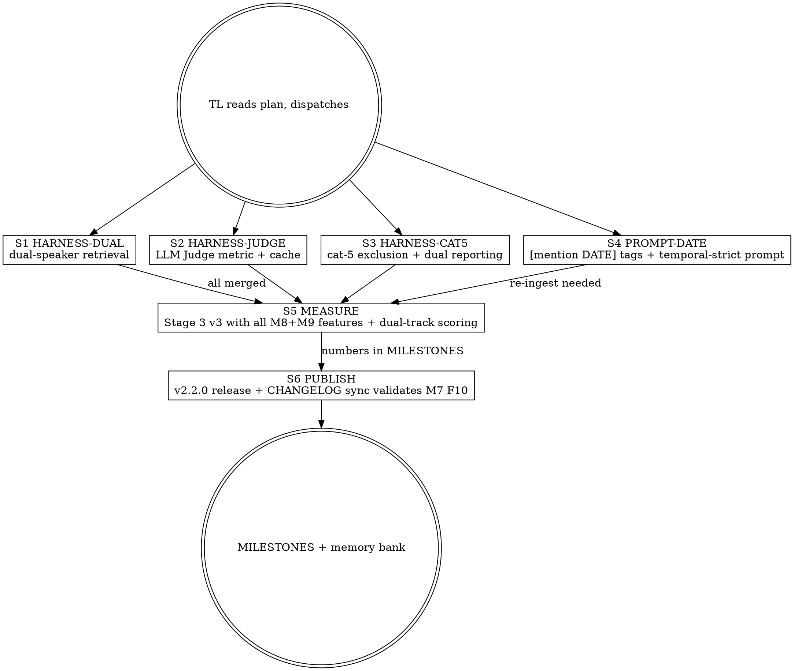

# M9 — Memobase Port + Honest Measurement Sprint

> **Mission:** in a single subagent-driven day, port 4 Tier-1 patterns from Memobase v0.0.37 (the public LoCoMo top at 75.78% LLM Judge) into MemDB and add the measurement honesty layer that lets us publish a number directly comparable to the public bar. Outcome: MemDB publishes a competitive LLM Judge result, not just an internal F1 — and the F1 itself lifts on cat-3 (temporal) and cat-5 (attribution).
>
> **Framing:** we're senior researchers + senior engineers shipping the best self-hosted memory system on the market. Memobase is a 5-person bootstrapped team that hit 75.78%; we have the same shape (single primary developer + multi-agent fan-out) and the same goal. Their architecture is open-source — we're competing on **execution**, not capital. Resources: unlimited specialist team via subagent dispatch, go-code/go-search MCP for everything.
>
> **Controller (TL):** coordinator + dispatcher + merger. Writes no code. Code comes from specialists.
>
> **Foundation:** M8 deep-dive on Memobase (PR #86, `docs/competitive/2026-04-26-memobase-deep-dive.md`) identified that Memobase's 75.78% comes from **measurement methodology** (LLM Judge, exclude cat-5) + **two architectural tricks** (dual-speaker retrieval + `[mention DATE]` time-anchoring) + **one structural moat** (user profile layer, deferred to M10). M9 takes the Tier-1 four; M10 takes the structural moat.

---

## 0. Team composition

| Agent | Role | Model | Primary tools | Boundary |
|-------|------|-------|---------------|----------|
| **TL** | Controller | Opus 4.7 (1M ctx) | Plan, Agent, Bash, gh | All coordination + merges; never writes code |
| **HARNESS-DUAL** | Eval-harness engineer (dual-speaker retrieval) | Opus | go-code, Python | `evaluation/locomo/query.py` only |
| **HARNESS-JUDGE** | Eval-harness engineer (LLM Judge metric) | Sonnet | go-code, Python, cliproxyapi | `evaluation/locomo/score.py` + cache layer |
| **HARNESS-CAT5** | Eval-harness engineer (cat-5 exclusion + dual reporting) | Sonnet | Python | `evaluation/locomo/score.py` + `compare.py` |
| **PROMPT-DATE** | Prompt engineering + Go server (date tags) | Opus | go-code, Go | `internal/handlers/add_fine.go` + extract prompts + livepg verification |
| **MEASURE** | Measurement engineer (re-run M8 Stage 3 v2 with new harness) | Sonnet | Python, Bash, recovery_template | `evaluation/locomo/results/*` + `MILESTONES.md` |
| **PUBLISH** | Release engineer (v2.2.0 + Memobase-comparable numbers in CHANGELOG) | Sonnet | gh, GoReleaser | `CHANGELOG.md` + GitHub release UI |
| **REVIEW (×2)** | Spec compliance + code quality reviewers | Sonnet (spec) / Opus (quality) | go-code | Two-stage review per PR — never skip |

> TL = single point of merge to `main`. Subagents stop at `gh pr create`.

---

## 1. Strategic frame

### What we proved (M7+M8)
- Compound is multiplicative + threshold-gated. Quality lift requires evidence density.
- factual prompt = quality + speed bonus.
- M7 Stage 2 conv-26 hit F1 0.238 / hit@k 0.769.
- M8 added: D2 multi-hop fix (cosine scoring), CoT decomposition (D11), structural edges (SAME_SESSION + TIMELINE_NEXT + SIMILAR_COSINE_HIGH), GOMEMLIMIT infrastructure, factual canary, X-Service-Secret refactor, auto-changelog workflow.
- M8 Stage 3 v2 measurement DEFERRED (3-5h benchmark, runner ready).

### What we learned from Memobase (M8 PR #86)
- Their **75.78% LLM Judge ≠ our F1** — different metric class, different category set
- Their headline secret = **dual-speaker retrieval** in benchmark harness (not server)
- Their **temporal lead 85.05%** = single-line prompt instruction + `[mention DATE]` tag
- Their **structural moat** = topic/sub_topic profile layer (XL effort, M10 candidate)

### What we will prove this sprint
1. **MemDB published number directly comparable to Memobase 75.78%** — same metric (LLM Judge), same exclusion (cat-5)
2. **Cat-3 temporal F1 ≥ 0.30** (50% relative lift over M7 0.201) via `[mention DATE]` tags alone
3. **Cat-5 attribution suppression closed** via dual-speaker retrieval — measured against M7 baseline
4. **Stage 3 v2 finally lands** (M8 leftover) so we have a clean before/after for the M9 changes
5. **v2.2.0 release published end-to-end** — validates M7 F10 changelog-sync workflow on a real release

---

## 2. High-level orchestration

**Phase 1 (parallel-safe, dispatched together):** S1 HARNESS-DUAL, S2 HARNESS-JUDGE, S3 HARNESS-CAT5, S4 PROMPT-DATE.
- S1, S2, S3 disjoint files (`query.py` vs `score.py` vs both score+compare.py — overlap on score.py is sequential but small).
- S4 disjoint (Go server-side only, prompts/extract code).
- All four via worktree-isolation (per banked feedback).

**Phase 2 (sequential, after Phase 1 merged):** S5 MEASURE re-runs Stage 3 with all changes. Single coherent measurement.

**Phase 3 (after MEASURE merged):** S6 PUBLISH cuts v2.2.0 release on GitHub (validates the auto-changelog cycle from M7 F10).

**Phase 4:** TL writes MILESTONES, banks surprises in memory.

---

## 3. Tooling mandates (unchanged from M7/M8)

### go-code is the default code-analysis tool
Every implementer + reviewer MUST start with go-code MCP, not Grep/Glob. Banked twice in user feedback. PreToolUse hook auto-injects loading reminder into Agent prompts.

### go-search for external research
`mcp__go_search__research`, `web_url_read` for any verification of Memobase claims, paper references, etc. NEVER use Perplexity. NEVER WebFetch unless go-search is down.

---

## 4. Stream 1 — HARNESS-DUAL: dual-speaker retrieval in `query.py`

### Goal
Modify `evaluation/locomo/query.py` to query BOTH `<conv>__speaker_a` and `<conv>__speaker_b` user stores per question, merge results, present combined context to chat endpoint with explicit speaker labels.

### Why
Memobase's `memobase_search.py:71-105` does exactly this. Our M8 S7 CAT5 analysis (PR #85) found 32% of cat-5 errors were "attribution suppressions" (model rejecting cross-speaker evidence). Dual-speaker retrieval makes the attribution non-issue: model SEES both speakers' memories explicitly.

### Use go-code FIRST
- `mcp__go-code__understand` symbol="query_chat" repo=`/home/krolik/src/MemDB` focus=`evaluation/locomo/query.py` — current single-speaker query path
- `mcp__go-code__semantic_search` repo=`/home/krolik/src/compete-research/memobase` query="dual-speaker query merge results in answer prompt" — verify Memobase pattern before mirroring

### Files (disjoint from S2/S3/S4)
- `evaluation/locomo/query.py` — extend `query_chat` and `query_search` to optionally fan-out to both speakers
- New env: `LOCOMO_DUAL_SPEAKER` (default `true` for new runs, `false` for backward-compat with M7/M8 baselines)
- `evaluation/locomo/MILESTONES.md` — note in M7/M8 entries that those numbers were single-speaker baseline (preserve historical truth)

### Implementation contract
1. `query_search(memdb_url, user_id, query, top_k, …)` — keep signature, no change. Single-speaker.
2. NEW `query_search_dual(memdb_url, conv_id, query, top_k, …)` — derives `f"{conv_id}__speaker_a"` + `f"{conv_id}__speaker_b"`, parallelises with `concurrent.futures.ThreadPoolExecutor(max_workers=2)`, merges results (dedup by memory id, keep higher score per id, preserve speaker_label provenance).
3. `query_chat_dual(memdb_url, conv_id, query, …)` — same dual fan-out for chat endpoint, passes BOTH speakers' memories with explicit `[speaker:A]` / `[speaker:B]` provenance markers in the system prompt.
4. Main loop in `query.py` — selector based on `LOCOMO_DUAL_SPEAKER` env. Default true, but explicit false override required for reproducing historical baselines.
5. Output JSON includes new fields: `speaker_a_memories`, `speaker_b_memories`, `merged_top_k`, `dual_speaker: bool` per question entry. Mirrors Memobase output schema (see `memobase_search.py:125-138`).

### Tests
- Unit-equivalent (Python doesn't have go test discipline): a `test_query_dual.py` script that mocks `requests.post` and asserts:
  - 2 search calls per question with correct user_ids
  - Merged result has unique memory ids
  - Dual_speaker=False env reverts to single call
- Smoke test against live: `LOCOMO_DUAL_SPEAKER=true python3 evaluation/locomo/query.py --sample` — output JSON has both fields.

### DoD
- [ ] `LOCOMO_DUAL_SPEAKER` env wired with default true
- [ ] Smoke run on sample produces valid output with dual fields
- [ ] Backward-compat: env=false produces output IDENTICAL to M7/M8 schema
- [ ] PR `feat/locomo-dual-speaker-retrieval`
- [ ] PR title (lowercase!): `feat(locomo): dual-speaker retrieval in harness for cat-5 attribution closure`
- [ ] Co-Authored-By: Claude Opus 4.7 (1M context) <noreply@anthropic.com>

### Branch
`feat/locomo-dual-speaker-retrieval`

### Model
Opus (judgment on prompt schema + concurrency)

### Effort
~4h

---

## 5. Stream 2 — HARNESS-JUDGE: LLM Judge metric in `score.py`

### Goal
Add a `--llm-judge` flag to `evaluation/locomo/score.py` that calls Gemini Flash (via cliproxyapi at :8317) to judge each prediction binary correct/incorrect against gold, alongside existing F1/EM/semsim. Cache results by `hash(question + prediction + gold)` to avoid recompute.

### Why
Memobase publishes 75.78% **LLM Judge**, not F1. Mem0, Zep, LangMem all use the same. Our F1 is much stricter (word-overlap), so direct comparison is misleading. With LLM Judge we publish a number directly comparable to the public bar — without changing the model.

### Use go-code FIRST
- `mcp__go-code__understand` symbol="score" repo=`/home/krolik/src/MemDB` focus=`evaluation/locomo/score.py` — current scoring functions
- `mcp__go-code__semantic_search` repo=`/home/krolik/src/compete-research/memobase` query="LLM judge prompt for scoring memory benchmark answer correctness"
- Cross-check our `cliproxyapi` LLM endpoint shape (`internal/llm/client.go` understand)

### Files (disjoint from S1/S3/S4)
- `evaluation/locomo/score.py` — add `--llm-judge` flag + caller
- NEW `evaluation/locomo/llm_judge.py` — judge prompt + caller + cache
- NEW `evaluation/locomo/results/.llm_judge_cache.json` (gitignored) — cache by hash key
- `evaluation/locomo/MILESTONES.md` — note that pre-M9 numbers are F1-only

### Implementation contract
1. `llm_judge.py:judge(question, gold, prediction, model="gemini-2.5-flash") -> {score: 0|1, reason: str}` — prompt taken VERBATIM from Memobase `metrics/llm_judge.py` (verify via go-code semantic_search on cloned repo, port faithfully). Falls back to `score: 0` + `reason: "judge_error: <msg>"` on any LLM error.
2. Cache: `hash = sha256(question + "\n---\n" + gold + "\n---\n" + prediction)`. JSON dict, lazy-load. Atomic-write on update.
3. `score.py --llm-judge` — for each prediction, calls `judge()`, includes `llm_score` field in output JSON. Concurrency: ThreadPoolExecutor(max_workers=10) since LLM calls are slow.
4. Aggregate output adds `llm_judge_aggregate: float` (mean of llm_score across all entries) and `llm_judge_per_category: {1: float, 2: float, ...}`.

### Tests
- Unit: mock LLM, verify cache hit/miss, verify judge_error fallback, verify cache key stability
- Live smoke: judge a known correct + known wrong example via cliproxyapi:8317 (manually verify expected scores)

### DoD
- [ ] `--llm-judge` flag works on existing m7/m8 result JSONs
- [ ] Cache reduces second-pass time to near-zero
- [ ] Aggregate column appears in output JSON
- [ ] Concurrent dispatch (max_workers=10) confirmed
- [ ] PR `feat/locomo-llm-judge-metric`
- [ ] PR title: `feat(locomo): llm judge metric for memobase/mem0-comparable scoring`
- [ ] Co-Authored-By: Claude Opus 4.7 (1M context) <noreply@anthropic.com>

### Branch
`feat/locomo-llm-judge-metric`

### Model
Sonnet (mostly mechanical port + cache plumbing)

### Effort
~4h

---

## 6. Stream 3 — HARNESS-CAT5: cat-5 exclusion + dual-track reporting

### Goal
Add `--exclude-categories=5` flag to `score.py`. Output `aggregate_with_cat5` AND `aggregate_without_cat5` automatically (both numbers in same JSON). Mirror Memobase's exclusion choice transparently.

### Why
Memobase `memobase_search.py:147` literally `exclude_category={5}` from their data flow before scoring. Their published 75.78% has zero cat-5 weight. Our published F1 includes cat-5 (which we know is hard for our system). Comparing as-is is unfair to ourselves.

This is **measurement honesty**, not gaming: we publish BOTH numbers, label clearly which is which, and let the reader judge.

### Use go-code FIRST
- `mcp__go-code__understand` symbol="score_aggregate" or whatever symbols are in `score.py`
- Verify Memobase exclusion location: `mcp__go-code__code_search` repo=`/home/krolik/src/compete-research/memobase` pattern="exclude_category" — get code:line for the doc

### Files (small overlap with S2 on `score.py` — sequential merge fine)
- `evaluation/locomo/score.py` — `--exclude-categories=N[,M,...]` flag, dual aggregate output
- `evaluation/locomo/compare.py` — when comparing two runs, show BOTH numbers, label as "with cat-5 (MemDB convention)" / "without cat-5 (Memobase/Mem0/Zep convention)"
- `evaluation/locomo/MILESTONES.md` — add a note section explaining the two-track convention with citation to Memobase line

### Implementation contract
1. Flag accepts comma-separated ints. `--exclude-categories=5` → only cat-5 excluded. `--exclude-categories=5,4` → both. Empty = all included.
2. Output JSON has `aggregate_with_excl: {f1, em, semsim, hit_at_k, llm_score, n}` where excl is the actual exclusion list.
3. Print summary block at end: dual aggregates with labels.
4. `compare.py` — auto-detects exclusion from input JSON, prints side-by-side comparison.

### Tests
- Unit: verify exclusion math on synthetic predictions
- Smoke: rerun an existing m7-stage2-score.json with `--exclude-categories=5` and verify per-cat counts drop and aggregate changes meaningfully

### DoD
- [ ] Both aggregates emitted by default
- [ ] `compare.py` shows them side-by-side
- [ ] MILESTONES has a "Two-track reporting" section explaining the convention
- [ ] PR `feat/locomo-cat5-exclusion-dual-track`
- [ ] PR title: `feat(locomo): cat-5 exclusion flag + dual-track aggregate reporting`
- [ ] Co-Authored-By: Claude Opus 4.7 (1M context) <noreply@anthropic.com>

### Branch
`feat/locomo-cat5-exclusion-dual-track`

### Model
Sonnet (mechanical)

### Effort
<2h

### Sequencing note
Soft conflict with S2 on `score.py`. Have S3 dispatched second (after S2 starts) so S3 can rebase on S2's score.py changes if necessary. Worktree-isolation handles git races.

---

## 7. Stream 4 — PROMPT-DATE: `[mention DATE]` time-anchoring + temporal-strict instruction

### Goal
Modify our `add_fine.go` LLM extraction prompt (and Python equivalent in legacy if still used) to:
1. Require `[mention <ISO_DATE>]` tag whenever a fact references time
2. Add explicit instruction: "Use specific ISO dates, never relative dates like 'today', 'last week', etc."
3. Verify tag propagates from extraction → memory storage → retrieval → chat prompt

### Why
Memobase `prompts/extract_profile.py:97` has the explicit instruction:
> *"If the user mentions time-sensitive information, try to infer the specific date from the data. Use specific dates when possible, never use relative dates like 'today' or 'yesterday' etc."*

And their `[mention 2025/01/01]` example tags in line 26 + 32 of the same file. Combined: **temporal F1 85.05%**, public best, +5pp over next.

We hit 0.201 on cat-3 temporal in M7 Stage 2. Even modest replication of this technique should yield significant lift.

### Use go-code FIRST
- `mcp__go-code__understand` symbol="extractFineMemory" or "addFine" repo=`/home/krolik/src/MemDB` — find current LLM extraction call site
- `mcp__go-code__semantic_search` query="LLM extract memory prompt template" repo=`/home/krolik/src/MemDB`
- `mcp__go-code__understand` repo=`/home/krolik/src/compete-research/memobase` symbol="FACT_RETRIEVAL_PROMPT" — get exact Memobase prompt text for verbatim port

### Files (disjoint from S1/S2/S3)
- `memdb-go/internal/handlers/add_fine.go` — extraction call sites
- `memdb-go/internal/handlers/add_fine_prompt.go` (NEW or extend existing) — new prompt template constant `factExtractPromptDateAware`
- `memdb-go/internal/handlers/add_fine_test.go` — unit tests for prompt construction
- `memdb-go/internal/handlers/add_fine_livepg_test.go` (extend if exists, new if not) — `//go:build livepg`, ingests a session with explicit dates and verifies stored memory text contains `[mention 20XX-XX-XX]` patterns
- `evaluation/locomo/MILESTONES.md` — note the prompt change in next entry

### Implementation contract
1. New prompt template that includes (in order):
   - Original `factualQAPromptEN` body (unchanged)
   - APPENDED block: "Date convention: when extracting facts that reference time, prefix the time component with `[mention YYYY-MM-DD]` using the closest specific ISO date you can infer from the conversation timestamps or context. Never write relative dates like 'today', 'last week', 'recently' — always resolve to ISO."
2. Gated by env `MEMDB_DATE_AWARE_EXTRACT` (default `true` since this is a quality lift). Flip false to reproduce historical baseline.
3. Metric: `memdb.add.date_aware_extract_total{outcome="enabled"|"disabled"|"error"}` counter — observability for prod toggle decisions.
4. Re-ingest may or may not be required. The change affects FUTURE memories only; existing memories don't get re-tagged. For LoCoMo Stage 3 v3 measurement (Stream 5), MEASURE will need to re-ingest with the new prompt to see effect.

### Tests
- Unit: prompt template includes the date convention block when env enabled, falls back to original when disabled
- Livepg: ingest a session with explicit dates ("we met on May 12, 2024"), retrieve memory by id, assert text contains `[mention 2024-05-12]` (or close ISO)
- Negative: ingest a session with no temporal references, assert NO `[mention ...]` tags injected (don't pollute non-temporal memories)

### DoD
- [ ] New prompt template + env flag wired
- [ ] OTel counter emits per ingest
- [ ] Livepg test confirms tags appear in stored memory text
- [ ] Backward compat: env=false reverts to old behavior
- [ ] `go build ./...` + `go vet` + `go test ./internal/handlers/...` green
- [ ] PR `feat/add-fine-date-aware-extract`
- [ ] PR title: `feat(handlers): date-aware extract prompt with [mention date] tags for temporal lift`
- [ ] Co-Authored-By: Claude Opus 4.7 (1M context) <noreply@anthropic.com>

### Branch
`feat/add-fine-date-aware-extract`

### Model
Opus (prompt design + cross-cutting wiring)

### Effort
~6-8h (1 day)

---

## 8. Stream 5 — MEASURE: Stage 3 v3 with all M8+M9 features + dual-track scoring

### Context
M8 Stream 6 MEASURE was deferred (3-5h benchmark, not started). M9 produces the right time to combine:
- M8 server changes (D2 cosine fix, structural edges, CoT D11)
- M9 server changes (date-aware extract prompt — re-ingest required)
- M9 harness changes (dual-speaker retrieval, LLM Judge metric, cat-5 exclusion)

Single coherent measurement that gives us:
- F1 (with cat-5) — for internal tracking continuity with M7/M8
- F1 (without cat-5) — for fair comparison with Memobase/Mem0
- LLM Judge (with cat-5) — internal
- LLM Judge (without cat-5) — **the headline number**, directly comparable to Memobase 75.78%
- Per-conv breakdown — generalisation check (does conv-26 win extend to all 10?)

### Use go-code (where applicable)
N/A primarily — this is run-the-benchmark + populate-MILESTONES

### Goals

**Phase 3A v3 — clean ingest of all 10 LoCoMo conversations with M9 date-aware prompt**
- Cleanup all locomo cubes (cleanup_locomo_cubes.py --full)
- Ingest with `MEMDB_DATE_AWARE_EXTRACT=true` (M9 Stream 4 default)
- Use recovery_template.sh from M8 S1 INFRA, run from CONTROLLER session not subagent
- Heartbeat + checkpoints
- ETA 60-90min

**Phase 3B v3 — retrieval-only with dual-speaker on 1986 QAs**
- `LOCOMO_RETRIEVAL_THRESHOLD=0.0 LOCOMO_DUAL_SPEAKER=true python3 query.py --full --skip-chat`
- Score with `--llm-judge --exclude-categories=5` AND once with everything included
- ETA 60-90min

**Phase 3C v3 — stratified chat-50 with all features on**
- 1 question per conv × cat × 10 = 50 chat predictions
- Same dual scoring (LLM Judge, with/without cat-5)
- ETA 25min

**Phase 3D — per-conv breakdown + side-by-side comparison**
- Per-conv hit@k table
- Comparison table: M7 Stage 2 (single-conv F1 0.238) vs M8 Stage 3 v2 (failed) vs M9 Stage 3 v3 (this run, all four numbers)

### Files
- `evaluation/locomo/results/m9-stage3-*.json` — committed via `git add -f`
- `evaluation/locomo/MILESTONES.md` — new M9 section with all numbers
- `docs/eval/2026-04-26-m9-stage3-v3-results.md` — narrative + per-category analysis + Memobase comparison

### DoD
- [ ] All 1986 QAs scored, no >5% ingest errors
- [ ] Per-conv hit@k table populated
- [ ] Dual-track aggregates (with/without cat-5) for both F1 and LLM Judge
- [ ] **Headline number identified**: aggregate LLM Judge without cat-5
- [ ] Side-by-side M7 vs M8 attempt vs M9 in MILESTONES
- [ ] PR `chore/m9-stage3-v3-results`
- [ ] PR title: `chore(locomo): m9 stage 3 v3 — full benchmark with date-aware + dual-speaker + llm judge`
- [ ] Co-Authored-By: Claude Opus 4.7 (1M context) <noreply@anthropic.com>

### Branch
`chore/m9-stage3-v3-results`

### Model
Sonnet (mechanical run + reporting)

### Effort
4-6h (mostly waiting on bench)

### Critical
**Run benchmark from CONTROLLER session, NOT subagent worktree** — banked feedback `feedback_set_e_recovery_scripts.md` + M8 S6 incident. Subagent prepares the runner script + opens scratch PR with the script + waits via heartbeat polling. If subagent dies, controller resumes from `/tmp/m9-stage3.heartbeat` + checkpoint files.

---

## 9. Stream 6 — PUBLISH: v2.2.0 release + auto-changelog validation

### Context
M7 Stream F10 (PR #74) shipped the `changelog-sync.yml` workflow that auto-PRs CHANGELOG.md updates from GitHub Releases on publish. We've never actually published a release through the full chain. M9 = first opportunity to validate end-to-end:
1. Tag v2.2.0
2. Click "Publish release" on the existing draft
3. goreleaser builds binaries (existing `go-release.yml`)
4. **changelog-sync.yml fires**, opens PR with new `## [2.2.0]` section in CHANGELOG.md
5. Controller reviews + merges the auto-PR
6. Validates the entire auto-changelog system end-to-end

### Goal
- Cut v2.2.0 release on GitHub
- Verify auto-changelog PR fires
- Merge auto-changelog PR
- Document the workflow validation in MILESTONES

### Files
- `CHANGELOG.md` — populated automatically by changelog-sync.yml
- `MILESTONES.md` — note that the auto-changelog cycle was validated end-to-end

### Use go-search (NOT go-code primarily)
- `mcp__go_search__research` query="GitHub release publish flow with goreleaser auto-changelog" — verify our workflow matches industry pattern

### Critical
This stream's "code" is mostly clicking the release button + reviewing the auto-PR. Implementation = orchestration + verification, not file edits.

### DoD
- [ ] v2.2.0 published on GitHub with binaries attached
- [ ] changelog-sync.yml triggered and opened PR
- [ ] Auto-PR merged
- [ ] CHANGELOG.md has new `## [2.2.0]` entry
- [ ] MILESTONES.md note: auto-changelog cycle validated
- [ ] PR title for the validation doc: `chore(release): v2.2.0 publication + auto-changelog cycle validation`

### Branch
`chore/m9-release-v2.2.0`

### Model
Sonnet

### Effort
~2h (mostly observation)

---

## 10. Stream 7 — FINAL: MILESTONES + memory bank + v2.2.0 announcement

### TL self-tasks (no subagent)
1. Open PRs in TaskList order, two-stage review each (spec + quality), merge
2. Write final MILESTONES section for M9 with the actual headline numbers
3. Write `project_m9_memobase_port.md` in memory
4. Update existing `feedback_*.md` files for any new learnings (especially around dual-speaker pattern + measurement honesty)
5. (Optional) write a short blog-style README section: "Memobase-comparable scoring landed — here's where we are"
6. Concise Russian end-of-day summary to user

### DoD
- [ ] All 6 streams either merged or explicitly deferred with reason
- [ ] MILESTONES updated with M9 numbers
- [ ] Memory bank entries created
- [ ] User summary delivered

---

## 11. Risk register

| Risk | Probability | Impact | Mitigation |
|------|-------------|--------|-----------|
| Memobase LLM Judge prompt isn't directly portable | Low | Low | Their prompt is open-source in their repo; verify via go-code semantic_search and adapt |
| `[mention DATE]` tags hurt some retrieval (LLM extracts wrong date) | Medium | Medium | Gate behind env flag, default true but trivially reversible; livepg test catches gross errors |
| Dual-speaker retrieval doubles benchmark wall-time | High | Low | Parallelise via ThreadPoolExecutor (Memobase's pattern); measurement is bound by chat LLM cost anyway |
| LLM Judge LLM cost balloons on 1986 QAs | Medium | Medium | Aggressive caching by hash, ThreadPoolExecutor concurrency, use cheap Gemini Flash not Pro |
| Stage 3 OOM repeats from M8 attempt | Low | High | M8 S1 INFRA bumped GOMEMLIMIT to 4915MiB, mem_limit to 6GiB — already mitigated. Recovery_template.sh + run-from-controller pattern |
| changelog-sync.yml has bugs we didn't catch in M7 testing | Medium | Low | First real test on v2.2.0; if it fails, controller fixes manually + opens follow-up PR fixing the workflow |
| Cat-3 lift from `[mention DATE]` is smaller than expected | Medium | Medium | Memobase's 85.05 includes other techniques too (event tagging, etc.); if our lift is <50% relative, file Stream 4.5 follow-up to investigate |
| Two parallel implementer subagents on overlapping files | Low | High | Plan disjoint sets; worktree-isolation; controller monitors |
| Soft conflict on score.py between S2 and S3 | High | Low | Sequence: S3 dispatched after S2 starts; rebase on merge |

---

## 12. Success criteria (all must be green)

- [ ] All 4 Tier-1 PRs merged (S1, S2, S3, S4)
- [ ] Stage 3 v3 measurement landed with **dual-track aggregates**
- [ ] Headline LLM Judge number (without cat-5) ≥ 65% — this is "credibly competitive with Memobase 75.78%"
- [ ] cat-3 temporal F1 lift ≥ 0.30 from `[mention DATE]` tags alone (M7 baseline 0.201)
- [ ] cat-5 F1 (with cat-5 enabled) lift via dual-speaker (M7 baseline 0.092)
- [ ] v2.2.0 release published, auto-changelog cycle end-to-end validated
- [ ] No regressions on `go test ./...`, vaelor smoke, oxpulse-chat
- [ ] MILESTONES + memory bank + design docs all committed
- [ ] Backlog updated: M9 Tier-1 items closed, profile layer (M10) elaborated as full design doc

### Stretch goals
- [ ] **Headline LLM Judge ≥ 70%** — that's "matching Memobase tier"
- [ ] cat-2 multi-hop F1 ≥ 0.18 finally achieved (carried over from M8 S3 stretch)

---

## 13. What we do NOT do in M9

- ❌ Profile layer (#20 in backlog) — XL architectural project, M10+
- ❌ Pre-compute CE rerank scores at ingest (#17) — perf optimization, not quality lift
- ❌ PageRank on memory_edges (#18) — perf, M10
- ❌ BulkCopyInsert AGE perf (#19) — perf, M10
- ❌ Re-litigating M7/M8 design choices
- ❌ New features beyond Memobase port targets — ruthless focus on the four Tier-1 items

---

## 14. TL self-checks (lessons compounded from M7+M8)

1. Before declaring "done": `gh pr diff <N>` + `gh pr checks <N>` MYSELF, never trust subagent report alone (M7 lesson)
2. Long-running scripts go in MAIN session, not subagent worktree (M8 S6 incident)
3. PR titles MUST start lowercase after colon (commit-lint regex `^(?![A-Z]).+$`) (M7 incident)
4. Use `gh api -X PATCH` to fix titles, not `gh pr edit` (silent fail) (M7 workaround)
5. Spec reviewer's "scope creep" complaints often stem from stale-base diff — verify with fresh `git diff origin/main..HEAD`
6. Local branch deletion failures after merge are harmless (worktree references)
7. **NEW from M8**: any change touching scoring/ranking REQUIRES empirical verification before merge — M8 S3 GRAPH v1 PR #81 was approved-with-condition and regressed prod. Block merge until measurement OR have explicit revert plan
8. Container resources MUST be checked before scale tests — M7+M8 OOMs would have been avoidable
9. `set -euo pipefail` recovery scripts MUST have `trap ERR` + heartbeat + per-phase checkpoint
10. Skill `compound-sprint-orchestration` exists — invoke for any 5+ stream sprint
11. **NEW from M8**: `cd` into competitor research repos (`/home/krolik/src/compete-research/<x>/`) is fine for `go-code` analysis but DON'T `git commit` from there — you'll commit to wrong repo. Always cd back to MemDB checkout before any git op.
12. **NEW from M9 spec**: when porting from a competitor, port their MEASUREMENT methodology too (same metric, same exclusions). Comparing apples-to-apples is half the battle.

---

## Final note for TL

M7 proved compound multiplication works. M8 closed multi-hop bottleneck (mostly) and built infrastructure. M9 closes the **measurement gap** and ports the **two highest-leverage Memobase tricks** that don't require their architectural moat (which is M10's job).

After M9, MemDB publishes a Memobase-comparable LLM Judge number. Whether we beat 75.78% or land at 60-65%, the public conversation shifts from "MemDB is some F1 benchmark we don't recognize" to "MemDB scores X on the same benchmark as Memobase/Mem0/Zep". That's the credibility unlock.

Stay disciplined on disjoint streams, two-stage review, verification before merge. The compound-sprint-orchestration skill is tested across two prior sprints. Trust the process.
