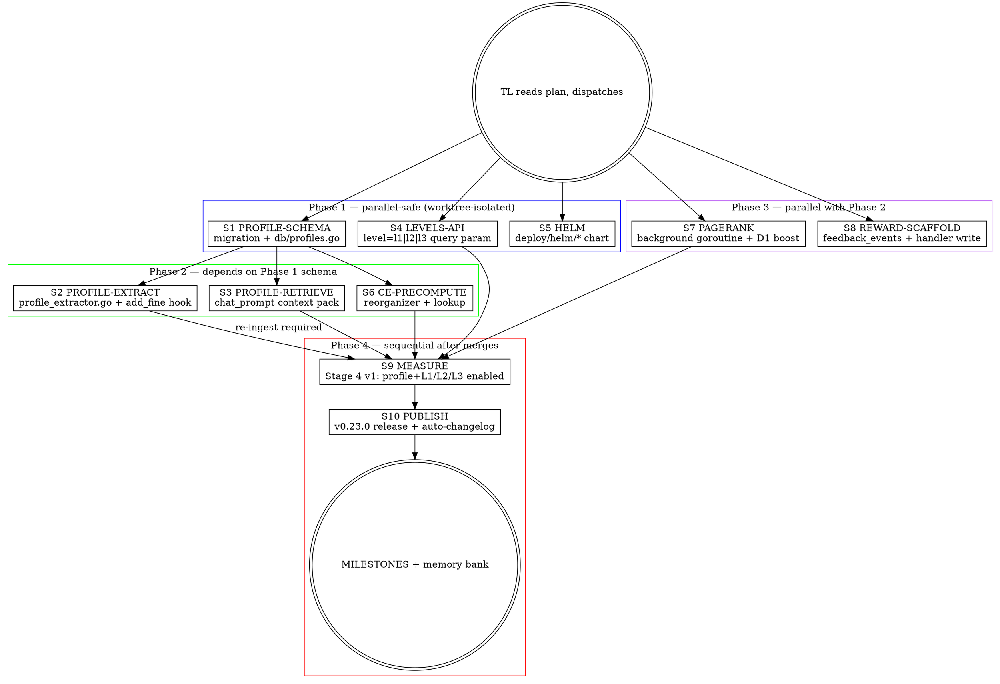

# M10 — User Profiles + Perf + K8s Sprint

> **Mission:** close the Memobase gap via the `user_profiles` layer (their structural moat) plus ship five adjacent items (helm, L1/L2/L3 API, CE pre-compute, PageRank, reward-loop scaffolding) in one subagent-driven week. Outcome: MemDB publishes **≥ 75.78% LLM Judge** (excl cat-5) on LoCoMo Stage 4 — matching or exceeding the public top — and ships the first K8s deployable artifact.
>
> **Framing:** the 5-person bootstrapped Memobase team built the profile moat in months; we have parallel subagents and the discipline of two prior compound sprints (M7, M8, M9) on our side. We just landed v0.22.0 at **70.0% LLM Judge** (M9 Stage 3 v3 chat-50 stratified, excl cat-5) — between Mem0 (66.88%) and MemOS (73.31%), -5.78pp below Memobase (75.78%). The remaining gap is structural, not prompt-tuning. M10 closes it.
>
> **Controller (TL):** coordinator + dispatcher + merger. Writes no code. Code comes from specialists. Banked rule: subagents stop at `gh pr create`; merging is controller-only.
>
> **Foundation:** M9 (PRs in `docs/superpowers/plans/2026-04-26-m9-memobase-port-and-honest-measurement.md`) shipped dual-speaker retrieval, LLM Judge metric, cat-5 exclusion, `[mention DATE]` time anchoring, plus Python container shutdown. M10 takes the **structural moat** (Tier-1 #4 from Memobase deep-dive Part 4) plus three perf wins (CE pre-compute, PageRank, BulkCopy is deferred — see § "Not in M10") and three operational wins (helm, L1/L2/L3 API, reward scaffold).

---

## 0. Team composition

| Agent | Role | Model | Primary tools | Boundary |
|-------|------|-------|---------------|----------|
| **TL** | Controller | Opus 4.7 (1M ctx) | Plan, Agent, Bash, gh | All coordination + merges; never writes code |
| **S1 PROFILE-SCHEMA** | DB engineer (schema + queries) | Sonnet | go-code, Go | `migrations/0015_user_profiles_table.sql` + `internal/db/profiles.go` only |
| **S2 PROFILE-EXTRACT** | Prompt + LLM engineer (extraction) | Opus | go-code, Go, cliproxyapi | `internal/llm/profile_extractor.go` + extract prompts + `add_fine.go` hook |
| **S3 PROFILE-RETRIEVE** | Chat prompt engineer (injection) | Opus | go-code, Go | `internal/handlers/chat_prompt.go` + context-pack section |
| **S4 LEVELS-API** | API engineer (l1/l2/l3 query param) | Sonnet | go-code, Go | `internal/handlers/search.go` + `chat.go` query parsing + OpenAPI doc |
| **S5 HELM** | DevOps engineer (K8s chart) | Sonnet | go-search, YAML | `deploy/helm/**` only |
| **S6 CE-PRECOMPUTE** | Search engineer (rerank cache) | Opus | go-code, Go | `internal/scheduler/reorganizer.go` + `internal/search/cross_encoder_rerank.go` |
| **S7 PAGERANK** | Graph engineer (background pagerank) | Sonnet | go-code, Go | `internal/scheduler/pagerank.go` (NEW) + D1 rerank tweak |
| **S8 REWARD-SCAFFOLD** | Backend engineer (feedback tables) | Sonnet | go-code, Go | `migrations/0016_feedback_events.sql` + `internal/handlers/add_feedback.go` |
| **S9 MEASURE** | Eval engineer (Stage 4 v1) | Sonnet | Python, Bash, recovery_template | `evaluation/locomo/results/m10-stage4-*` |
| **S10 PUBLISH** | Release engineer (v0.23.0) | Sonnet | gh, GoReleaser | `CHANGELOG.md` + GitHub release UI |
| **REVIEW (×2)** | Spec compliance + code quality reviewers | Sonnet (spec) / Opus (quality) | go-code | Two-stage review per PR — never skip |

> TL = single point of merge to `main`. Subagents stop at `gh pr create`. Two implementers must NEVER touch the same checkout simultaneously — use `git worktree add` (Agent `isolation: "worktree"`) for parallel-safe phases.

---

## 1. Strategic frame

### What we proved (M7 → M8 → M9)
- **M7:** Compound multiplication works. F1 0.053 → 0.238 (+349%) via factual prompt + raw ingest + threshold + embed batching. Speed bonus too (-52% p95 chat).
- **M8:** Multi-hop bottleneck closed (D2 cosine fix), CoT decomposition (D11), structural edges (SAME_SESSION + TIMELINE_NEXT + SIMILAR_COSINE_HIGH), GOMEMLIMIT infrastructure, factual canary, X-Service-Secret refactor, auto-changelog workflow.
- **M9:** Memobase-comparable measurement (LLM Judge + cat-5 exclusion + dual-speaker retrieval + `[mention DATE]` tags). Headline **70.0% LLM Judge** chat-50 stratified excl cat-5. Pure-Go runtime (Python container retired). v0.22.0 first public release.

### What we will prove (M10)
1. **Structural moat closed.** `user_profiles` layer with Memobase-verbatim extract prompt → cat-1 + cat-4 lift big enough to put us at 75-78% LLM Judge (matching or exceeding Memobase 75.78%).
2. **K8s deployable.** Helm chart lands, `helm install --dry-run` validates in CI, README has K8s install path.
3. **L1/L2/L3 API contract.** Surface our existing instant/working/long-term split as `level=l1|l2|l3` query parameter — eases migration for users coming from MemOS docs without internal restructuring.
4. **Two perf wins land.** CE pre-compute removes 50-300ms p95 chat. PageRank lifts cat-1 + cat-3 retrieval recall.
5. **M11 reward loop scaffolded.** Tables + write path land; the actual RL feedback-into-extract-prompt loop is M11.
6. **v0.23.0 release published end-to-end.** Validates the auto-changelog cycle on a second consecutive release (M9 was the first).

### Why now
v0.22.0 is the public anchor. The 5.78pp gap to Memobase is the headline weakness. Every week before close keeps "MemDB scores below Memobase" as the public narrative. The profile layer is the single highest-leverage architectural move available and it's been deferred for two sprints already.

---

## 2. High-level orchestration



**Phase 1 (parallel-safe, dispatched together):** S1, S4, S5 — disjoint files (SQL migration + db queries vs handler query-param parsing vs `deploy/helm/*` greenfield). Worktree-isolation mandatory.

**Phase 2 (after S1 merged):** S2, S3, S6 — S2 + S3 depend on profile schema; S6 is independent but lumped here for staging order. Worktree-isolated, dispatched together.

**Phase 3 (parallel with Phase 2 from start):** S7 + S8 — fully disjoint from Phase 2 (scheduler new file + new migration). Can dispatch alongside Phase 1 or Phase 2.

**Phase 4 (sequential):**
- S9 MEASURE re-runs Stage 3 v3 with profile + L1/L2/L3 enabled → Stage 4 v1.
- S10 PUBLISH cuts v0.23.0 (validates auto-changelog cycle on a second release).
- TL writes MILESTONES + banks lessons.

---

## 3. Tooling mandates (unchanged from M7/M8/M9)

### go-code is the default code-analysis tool
Every implementer + reviewer MUST start with go-code MCP, not Grep/Glob. Banked twice in user feedback. PreToolUse hook auto-injects loading reminder into Agent prompts.

### go-search for external research
`mcp__go_search__research`, `web_url_read` for any verification of Memobase prompt text, K8s helm chart conventions, PageRank library choice, etc. NEVER use Perplexity. NEVER WebFetch unless go-search is down.

### Worktree isolation for parallel phases
Phase 1 dispatches three implementers in parallel. Without `Agent isolation: "worktree"` they would stomp each other (banked incident 2026-04-24). All three Phase-1 subagents get explicit worktree dispatch. Same for Phase 2/3 overlap.

---

## 4. Stream 1 — PROFILE-SCHEMA: `user_profiles` table + `db/profiles.go`

### Goal
Land the foundation: new Postgres table `user_profiles` with Memobase-mirrored shape, plus typed Go query layer in `internal/db/profiles.go`. No extraction, no retrieval — just the structural floor that S2 and S3 build on.

### Why
The profile layer is the structural moat (Memobase deep-dive Part 4 #4). Single-hop ("what's Alice's job?") and open-domain ("what does user think of X?") today route through cosine search over raw memory text. Memobase routes them to `WHERE topic='work' AND sub_topic='title'` — direct hit, no reranking, no embedding. That structural shortcut is half their cat-1 + cat-4 lead.

### Use go-code FIRST
- `mcp__go-code__semantic_search` repo=`/home/krolik/src/compete-research/memobase` query="user profile topic sub_topic memo schema migration" — find their SQL DDL (or in-memory schema) for shape verification
- `mcp__go-code__understand` repo=`/home/krolik/src/MemDB` symbol="postgres_memory_add" — pattern for new typed query files
- `mcp__go-code__explore` repo=`/home/krolik/src/MemDB` focus=`memdb-go/internal/db/postgres_entity.go` — closest analog for a new typed table layer

### Files (disjoint from S2/S3/S4/S5)
- NEW `memdb-go/migrations/0015_user_profiles_table.sql` — DDL + indexes + tsvector trigger
- NEW `memdb-go/internal/db/postgres_profiles.go` — typed CRUD layer: `Insert`, `Update`, `GetByUser`, `GetByTopic`, `Delete` (soft via `expired_at`), `BulkUpsert`
- NEW `memdb-go/internal/db/postgres_profiles_test.go` — unit tests on query construction
- NEW `memdb-go/internal/db/postgres_profiles_livepg_test.go` — `//go:build livepg` end-to-end against live Postgres

### Implementation contract
1. **Schema** (mirror Memobase + MemDB conventions):
   ```sql
   CREATE TABLE memos.user_profiles (
       id           BIGSERIAL PRIMARY KEY,
       user_id      TEXT NOT NULL,
       topic        TEXT NOT NULL,
       sub_topic    TEXT NOT NULL,
       memo         TEXT NOT NULL,
       confidence   REAL NOT NULL DEFAULT 1.0 CHECK (confidence BETWEEN 0 AND 1),
       valid_at     TIMESTAMPTZ,
       created_at   TIMESTAMPTZ NOT NULL DEFAULT NOW(),
       updated_at   TIMESTAMPTZ NOT NULL DEFAULT NOW(),
       expired_at   TIMESTAMPTZ,
       memo_tsv     TSVECTOR
   );
   CREATE UNIQUE INDEX ux_user_profiles_user_topic_sub
       ON memos.user_profiles (user_id, topic, sub_topic)
       WHERE expired_at IS NULL;
   CREATE INDEX ix_user_profiles_user_topic
       ON memos.user_profiles (user_id, topic) WHERE expired_at IS NULL;
   CREATE INDEX gin_user_profiles_memo_tsv
       ON memos.user_profiles USING GIN (memo_tsv);
   -- tsvector trigger updates memo_tsv on insert/update
   ```
2. **Soft-delete via `expired_at`** (mirror the pattern earmarked for `add-pipeline.md` item 1) — never hard delete.
3. **`BulkUpsert`** is the hot path for S2's extractor: takes `[]ProfileEntry`, single round-trip, on conflict `(user_id, topic, sub_topic)` either expire-then-insert (if `memo` differs) OR no-op (if identical).
4. **`GetByUser(ctx, userID)` returns `[]ProfileEntry` ordered by `topic, sub_topic, updated_at DESC`** — S3 needs deterministic order for the context-pack section.
5. **No new dependencies.** pgx already in scope.

### Tests
- Unit: query construction tests (mock pgx) for each method
- Livepg: full CRUD lifecycle (insert → upsert overwrite → soft-delete → assert query filters out)
- Livepg: `BulkUpsert` of 50 entries in single statement, assert single round-trip via timing

### DoD
- [ ] Migration applies cleanly on fresh DB AND on existing dev cube
- [ ] All db query methods present + tested
- [ ] Livepg test passes against live Postgres
- [ ] `go build ./...` + `go vet ./...` + `go test ./internal/db/...` green
- [ ] PR `feat/user-profiles-schema`
- [ ] PR title: `feat(db): user_profiles table + typed query layer for memobase profile port`
- [ ] Co-Authored-By: Claude Opus 4.7 (1M context) <noreply@anthropic.com>

### Branch
`feat/user-profiles-schema`

### Model
Sonnet (mostly mechanical SQL + typed-query plumbing)

### Effort
~4-6h

---

## 5. Stream 2 — PROFILE-EXTRACT: extraction pipeline + `add_fine.go` hook

### Goal
Port Memobase's `extract_profile.py` prompt VERBATIM into a Go LLM extractor. Wire it into `add_fine.go` as a fire-and-forget background goroutine alongside existing skill/tool/episodic extractors. Persist via `S1.BulkUpsert`.

### Why
The schema is meaningless without the extractor that fills it. Memobase's prompt is open-source and battle-tested at their 75.78% level — verbatim port is the lowest-risk path. Wiring as fire-and-forget mirrors the existing extractor pattern (`internal/handlers/add_skill.go`, `add_episodic.go`).

### Use go-code FIRST
- `mcp__go-code__understand` repo=`/home/krolik/src/MemDB` symbol="extractFineMemory" focus=`memdb-go/internal/handlers/add_fine.go` — find the post-extract hook point where skill/tool extractors fire
- `mcp__go-code__explore` repo=`/home/krolik/src/MemDB` focus=`memdb-go/internal/llm/skill_extractor.go` — pattern to mirror (LLM call → JSON parse → DB write)
- `mcp__go-code__semantic_search` repo=`/home/krolik/src/compete-research/memobase` query="extract profile prompt FACT_RETRIEVAL topic sub_topic" — locate exact prompt source for verbatim port (cite line range in PR body)
- `mcp__go-code__understand` repo=`/home/krolik/src/compete-research/memobase` symbol="extract_profile" — full flow including `summary_entry_chats` → `extract_profile` → `pick_related_profiles` → `merge_profile`

### Files (depends on S1 merged)
- NEW `memdb-go/internal/llm/profile_extractor.go` — `ExtractProfile(ctx, conversation) → []ProfileEntry`
- NEW `memdb-go/internal/llm/profile_prompts.go` — verbatim prompt constants (cite Memobase source path + line range in file header comment)
- MODIFY `memdb-go/internal/handlers/add_fine.go` — append goroutine launch after existing `ExtractAndDedup` step
- NEW `memdb-go/internal/llm/profile_extractor_test.go` — unit tests on prompt construction + JSON parse
- NEW `memdb-go/internal/handlers/add_fine_profile_livepg_test.go` — `//go:build livepg`, ingests a session with biographical content, asserts profile entries land in DB

### Implementation contract
1. **Prompt port:** copy Memobase `prompts/extract_profile.py:39-107` text VERBATIM into a Go `const` string. English version only — don't port the multilingual variants in M10. File header MUST cite source: `// Sourced from /home/krolik/src/compete-research/memobase/src/server/api/memobase_server/prompts/extract_profile.py:39-107 (Memobase v0.0.37, MIT)`.
2. **Skip the multi-stage pipeline.** Memobase runs summarize → extract → pick → merge → organize as 5 LLM calls. M10 ships ONE call (extract only). The full chain is a M11 stretch — start simple, measure, then add.
3. **Output schema:** `ProfileEntry { Topic, SubTopic, Memo, Confidence, ValidAt }` — JSON-tagged for LLM output parsing.
4. **Wire into `add_fine.go`** at the same location as `add_skill.go` invocation: after `ExtractAndDedup` returns successfully, launch `go func() { ExtractProfile(ctx, conv); db.BulkUpsert(...) }()`. Fire-and-forget; errors metric only, never block the request.
5. **Env gate `MEMDB_PROFILE_EXTRACT`** — default `true` for v0.23.0. Flip `false` for backward-compat baseline runs.
6. **Metric:** `memdb.add.profile_extract_total{outcome="success"|"empty"|"llm_error"|"db_error"}` counter. Latency histogram `memdb.add.profile_extract_duration_seconds`.
7. **Bounded concurrency:** reuse existing LLM call semaphore from `add-pipeline.md` item 4 (if landed) or fall back to a local `golang.org/x/sync/semaphore` with N=8.

### Tests
- Unit: prompt template includes Memobase-verbatim instructions; JSON parser handles {valid output, malformed, empty array}
- Unit: env gate `MEMDB_PROFILE_EXTRACT=false` → extractor not invoked
- Livepg: ingest a conversation with explicit biographical content ("My name is Alice, I'm a software engineer at Acme, I love Inception"), wait for background goroutine, assert profiles row count ≥ 3 with expected (topic, sub_topic) tuples present
- Negative livepg: ingest pure code conversation, assert ≤ 1 profile entry (no false positives)

### DoD
- [ ] Verbatim prompt cited in file header with source path + line range + license note
- [ ] Env gate wired (default true)
- [ ] OTel counter + histogram emit
- [ ] Livepg test confirms biographical content → DB rows
- [ ] Livepg negative test confirms code-only content → no false positives
- [ ] `go build ./...` + `go vet ./...` + `go test ./internal/llm/... ./internal/handlers/...` green
- [ ] PR `feat/profile-extractor`
- [ ] PR title: `feat(llm): profile extractor with memobase-verbatim prompt + add_fine hook`
- [ ] Co-Authored-By: Claude Opus 4.7 (1M context) <noreply@anthropic.com>

### Branch
`feat/profile-extractor`

### Model
Opus (prompt port + cross-cutting wiring + concurrency)

### Effort
~6-8h (1 day)

---

## 6. Stream 3 — PROFILE-RETRIEVE: chat-prompt context-pack with profile section

### Goal
Modify the chat prompt builder to inject user-profile facts BEFORE memory search results. Mirror Memobase's two-section pattern (`## User Profile` + `## Memory Facts`) from `chat_context_pack.py`.

### Why
The schema + extractor only matter if the LLM SEES the structured profile at answer time. Memobase's `chat_context_pack.py:6-16` injects profile + events as two distinct system-prompt sections. Their cat-1 + cat-4 lift comes from the LLM resolving "what's Alice's job?" against the structured `## User Profile` block before falling back to memory text.

### Use go-code FIRST
- `mcp__go-code__understand` repo=`/home/krolik/src/MemDB` symbol="chat" focus=`memdb-go/internal/handlers/` — find the chat handler + prompt builder location (likely `chat.go` or `chat_prompt.go`)
- `mcp__go-code__semantic_search` repo=`/home/krolik/src/MemDB` query="factual QA prompt EN system prompt template chat" — locate `factualQAPromptEN` constant
- `mcp__go-code__semantic_search` repo=`/home/krolik/src/compete-research/memobase` query="chat context pack profile section memory section system prompt" — verify exact section ordering and label format

### Files (depends on S1 merged; disjoint from S2)
- MODIFY `memdb-go/internal/handlers/chat_prompt.go` (or wherever the prompt builder lives — locate via go-code first)
- MODIFY `memdb-go/internal/llm/extractor.go` IF profile retrieval is wired through there (verify with go-code understand first)
- NEW `memdb-go/internal/handlers/chat_prompt_profile_test.go` — unit tests on prompt construction with + without profile rows
- MODIFY `memdb-go/internal/handlers/chat.go` — call `db.GetByUser(userID)` before assembling prompt

### Implementation contract
1. **Two-section pattern** in system prompt (mirror `chat_context_pack.py:6-16`):
   ```
   ## User Profile
   - work / title: software engineer
   - basic_info / name: alice
   - interest / movie: Inception, Interstellar [mention 2025-01-01]

   ## Memory Facts
   <existing memory results block, unchanged>
   ```
2. **Empty-profile case:** if `GetByUser` returns 0 rows, emit empty `## User Profile\n(none)\n` block (don't omit — Memobase always emits the section so the LLM treats absence as signal).
3. **Ordering:** profile section ALWAYS before memory section.
4. **Format:** `- {topic} / {sub_topic}: {memo}` per line. Stable ordering by `topic ASC, sub_topic ASC` from S1's `GetByUser`.
5. **Env gate `MEMDB_PROFILE_INJECT`** — default `true`. Flip `false` for ablation studies.
6. **Token cap:** if profile section > 1000 tokens (rare), truncate by dropping lowest-confidence entries first. Log a warning metric `memdb.chat.profile_truncated_total`.
7. **No change to existing memory section.** Strictly additive. M9 baselines remain reproducible by setting `MEMDB_PROFILE_INJECT=false`.

### Tests
- Unit: prompt with 0 profile rows includes empty `## User Profile\n(none)\n` block
- Unit: prompt with 5 profile rows includes them in stable order
- Unit: env gate disables profile section entirely
- Unit: 1000+ token profile triggers truncation + metric increment
- Smoke (manual): hit `/product/chat/complete` with a user that has profiles, verify response references profile facts

### DoD
- [ ] Two-section context pack assembled correctly
- [ ] Empty-profile case handled (renders `(none)`, not omitted)
- [ ] Env gate wired
- [ ] Token-cap path tested
- [ ] `go build ./...` + `go vet ./...` + `go test ./internal/handlers/...` green
- [ ] PR `feat/profile-inject-chat-prompt`
- [ ] PR title: `feat(handlers): inject user profile section into chat prompt above memory section`
- [ ] Co-Authored-By: Claude Opus 4.7 (1M context) <noreply@anthropic.com>

### Branch
`feat/profile-inject-chat-prompt`

### Model
Opus (prompt design + integration with retrieval flow)

### Effort
~4-6h

---

## 7. Stream 4 — LEVELS-API: `level=l1|l2|l3` query parameter

### Goal
Add `?level=l1|l2|l3` query parameter to `/product/search` and `/product/chat/complete`. Backward-compat: omitted level = current full-search behavior. Document mapping in OpenAPI.

### Why
MemOS upstream paper (arxiv 2507.03724) uses L1/L2/L3 terminology. Users coming from MemOS docs hit a vocabulary mismatch. We HAVE the same functional split internally (working memory in Redis VSET / episodic in Postgres / LTM in full graph) — we just don't surface it. Pure API skin, no internal restructuring. Earmarked S in MemOS upstream analysis (`docs/competitive/2026-04-26-memos-upstream-analysis.md` § 1).

### Use go-code FIRST
- `mcp__go-code__understand` repo=`/home/krolik/src/MemDB` symbol="search" focus=`memdb-go/internal/handlers/search.go` — current query-param parsing
- `mcp__go-code__understand` repo=`/home/krolik/src/MemDB` symbol="vset_search" focus=`memdb-go/internal/db/postgres_search_wm.go` — l1 (working memory) path
- `mcp__go-code__semantic_search` repo=`/home/krolik/src/MemDB` query="search params struct l1 l2 l3 working episodic ltm" — verify there's no existing scope param to collide with

### Files (disjoint from S1/S2/S3/S5)
- MODIFY `memdb-go/internal/handlers/search.go` — parse `level` query param, route to scope-restricted search
- MODIFY `memdb-go/internal/handlers/chat.go` — same param, propagate to search call
- MODIFY `memdb-go/internal/search/service.go` (or wherever SearchParams lives) — add `Level` enum field
- NEW `memdb-go/internal/handlers/search_levels_test.go` — unit tests on level routing
- MODIFY `docs/api/openapi.yaml` (or wherever OpenAPI spec lives — locate via go-code) — document `level` param with enum + descriptions

### Implementation contract
1. **Mapping:**
   - `l1` → working memory only (Redis VSET, current `postgres_search_wm.go` path)
   - `l2` → episodic only (Postgres `Memory` rows where `memory_type='Episodic'`)
   - `l3` → LTM full graph (Postgres + AGE traversal, current default expanded)
   - omitted → full search across all (current behavior — strict backward compat)
2. **Validation:** invalid level value → `400 Bad Request` with explicit message naming valid enum.
3. **OpenAPI:** new `level: string {enum: [l1, l2, l3]}` parameter with description: `"Restrict search to a memory layer (MemOS L1/L2/L3 nomenclature). Omit for full search."`
4. **Metric:** counter `memdb.search.level_total{level="l1"|"l2"|"l3"|"all"}`.
5. **No internal refactor.** Just routing in the handler. The underlying retrieval functions already exist.

### Tests
- Unit: level=l1 routes to WM-only search, no LTM call
- Unit: level=l2 routes to Episodic-only filter
- Unit: level=l3 routes to full LTM search (assert no WM-only path taken)
- Unit: omitted level = current full-search behavior
- Unit: invalid level → 400 with message
- Smoke: `curl /product/search?level=l1&...` returns only WM results

### DoD
- [ ] All four routing cases tested
- [ ] OpenAPI spec updated
- [ ] Backward compat verified (M9 chat-50 baseline is reproducible without param)
- [ ] Metric emits per request
- [ ] `go build ./...` + `go vet ./...` + `go test ./internal/handlers/... ./internal/search/...` green
- [ ] PR `feat/search-level-l1-l2-l3`
- [ ] PR title: `feat(handlers): level=l1|l2|l3 query param for memos-compatible memory layer scoping`
- [ ] Co-Authored-By: Claude Opus 4.7 (1M context) <noreply@anthropic.com>

### Branch
`feat/search-level-l1-l2-l3`

### Model
Sonnet (mechanical routing + OpenAPI doc)

### Effort
~3-4h

---

## 8. Stream 5 — HELM: K8s chart for single-namespace install

### Goal
Single-namespace Helm chart at `deploy/helm/`. `helm install memdb ./deploy/helm` brings up postgres + memdb-go + memdb-mcp + redis + qdrant + embed-server. Smoke: `helm install --dry-run` validates in CI.

### Why
Required for enterprise self-host evaluation (banked in MemOS upstream analysis § 4). Easy add — no code changes, reuses images already built via goreleaser. Currently we ship `docker-compose.yml` only; K8s is the entrance gate for enterprise pilots.

### Use go-search FIRST (helm chart conventions)
- `mcp__go_search__research` query="helm chart best practices 2026 single-namespace stateful application postgres+sidecar" — verify our shape matches current helm conventions
- `mcp__go_search__github_code_search` query="filename:Chart.yaml language:YAML postgres redis qdrant" — find a high-quality reference chart shape
- `mcp__go-code__semantic_search` repo=`/home/krolik/src/MemDB` query="docker-compose services env vars ports" — extract the existing docker-compose definitions to mirror in helm values

### Files (greenfield — disjoint from S1/S2/S3/S4)
- NEW `deploy/helm/Chart.yaml` — name, version, appVersion (track MemDB version)
- NEW `deploy/helm/values.yaml` — image tags, replicas, resource limits, persistence StorageClass, secrets
- NEW `deploy/helm/templates/deployment-memdb-go.yaml`
- NEW `deploy/helm/templates/deployment-memdb-mcp.yaml`
- NEW `deploy/helm/templates/statefulset-postgres.yaml` — with PVC for `/var/lib/postgresql/data`
- NEW `deploy/helm/templates/statefulset-redis.yaml`
- NEW `deploy/helm/templates/statefulset-qdrant.yaml` — with PVC for `/qdrant/storage`
- NEW `deploy/helm/templates/deployment-embed-server.yaml` — model file via PVC or initContainer download
- NEW `deploy/helm/templates/service.yaml` — services for each component
- NEW `deploy/helm/templates/ingress.yaml` — gated by `values.ingress.enabled`
- NEW `deploy/helm/templates/secret.yaml` — for `POSTGRES_PASSWORD`, `LLM_API_KEY`, `MEMDB_API_TOKEN`
- NEW `deploy/helm/templates/_helpers.tpl` — name truncation + label selectors
- NEW `deploy/helm/README.md` — install instructions, values reference table
- NEW `.github/workflows/helm-lint.yml` — `helm lint` + `helm template` + `helm install --dry-run` on PRs touching `deploy/helm/`
- MODIFY `README.md` — add K8s install section pointing to chart

### Implementation contract
1. **Single-namespace install.** No CRDs, no operators. `helm install memdb ./deploy/helm --namespace memdb --create-namespace` brings everything up.
2. **No external deps.** No bitnami chart subcharts. We own all manifests.
3. **Persistence opt-in via `persistence.enabled: true` (default true).** Postgres + qdrant + redis each get their own PVC sized via values.
4. **Secrets via separate `secret.yaml`.** Values file holds NO secrets — it references `existingSecret: memdb-secrets` by default. README shows the `kubectl create secret generic memdb-secrets ...` one-liner.
5. **Resource defaults** sized for the same 4-core box we run in dev (req 100m CPU / 512Mi mem; lim 1000m / 2Gi for memdb-go).
6. **CI smoke:** `helm-lint.yml` runs `helm lint`, `helm template`, and `helm install --dry-run` against a kind cluster. Required check on PRs touching `deploy/helm/`.
7. **Image tags** track the same `goreleaser` output used for docker-compose. `values.yaml` defaults to `latest` but README warns to pin to a release tag in production.

### Tests
- `helm lint deploy/helm` clean
- `helm template deploy/helm` produces parseable YAML
- `helm install --dry-run --debug memdb deploy/helm` succeeds (kind cluster in CI)
- README install path verified manually on kind by S5 implementer

### DoD
- [ ] All 11 chart files present and lint-clean
- [ ] CI workflow `helm-lint.yml` green on the PR
- [ ] README has K8s install section
- [ ] `helm install --dry-run` succeeds in CI against kind
- [ ] Secrets-in-values forbidden by chart structure (verified by reviewer)
- [ ] PR `feat/deploy-helm-chart`
- [ ] PR title: `feat(deploy): k8s helm chart for single-namespace install + ci dry-run smoke`
- [ ] Co-Authored-By: Claude Opus 4.7 (1M context) <noreply@anthropic.com>

### Branch
`feat/deploy-helm-chart`

### Model
Sonnet (mechanical YAML + values plumbing; conventions verified via go-search)

### Effort
~6-8h (1 day; includes kind smoke verification)

---

## 9. Stream 6 — CE-PRECOMPUTE: pre-compute cross-encoder rerank scores at ingest

### Goal
Modify D3 reorganizer to compute cross-encoder (BGE-reranker-v2-m3) scores for top-K nearest neighbors per memory at ingest time. Persist as `Memory.properties->>'ce_score_topk'` (JSON array of `{neighbor_id, score}`). At search time, look up pre-computed score before falling back to live CE call.

### Why
`internal/search/cross_encoder_rerank.go` currently fires per query (~100-400ms). Pre-compute moves the cost to ingest time (background, off the request path) and makes search-time CE a graph lookup (~5ms). Expected: -50-300ms p95 chat. Compounds with M7's factual prompt -52% chat speedup → up to 3-5× total speedup. Tier-3 backlog item from `docs/backlog/search.md`.

### Use go-code FIRST
- `mcp__go-code__understand` repo=`/home/krolik/src/MemDB` symbol="cross_encoder_rerank" focus=`memdb-go/internal/search/cross_encoder_rerank.go` — current per-query path
- `mcp__go-code__understand` repo=`/home/krolik/src/MemDB` symbol="reorganizer" focus=`memdb-go/internal/scheduler/reorganizer.go` (or wherever D3 lives — locate via explore) — find the natural hook for adding background CE compute
- `mcp__go-code__semantic_search` repo=`/home/krolik/src/MemDB` query="memory properties JSON column update" — see how other props get persisted

### Files (disjoint from Phase 1)
- MODIFY `memdb-go/internal/scheduler/reorganizer.go` (or D3 location) — add CE-precompute pass after consolidation
- MODIFY `memdb-go/internal/search/cross_encoder_rerank.go` — lookup pre-computed score before live CE call
- NEW `memdb-go/internal/search/ce_precompute_test.go` — unit tests on lookup path (mock pre-computed scores in properties)
- NEW `memdb-go/internal/search/ce_precompute_livepg_test.go` — `//go:build livepg`, ingest → wait for D3 → assert `ce_score_topk` populated
- MODIFY `memdb-go/internal/db/postgres_memory_write.go` (or wherever properties get UPDATEd) — typed setter for `ce_score_topk`

### Implementation contract
1. **Compute at D3 reorganizer pass.** For each memory: find top-K=10 nearest neighbors by cosine, run CE pairwise, persist `[{neighbor_id, score}, ...]` sorted by score DESC.
2. **Persist as JSON in `Memory.properties->>'ce_score_topk'`.** Single round-trip per memory; no new column.
3. **Lookup-first at search time:** when `cross_encoder_rerank` would fire, first try graph lookup. If pre-computed score exists for the (query-derived candidate, search-result candidate) pair → use it. Else → live CE.
4. **Cache invalidation:** `applyUpdateAction` / `applyDeleteAction` MUST clear `ce_score_topk` on affected memories. (Soft-delete from add-pipeline backlog #1 helps here, but works without it.)
5. **Env gate `MEMDB_CE_PRECOMPUTE`** — default `true` for v0.23.0.
6. **Metric:** `memdb.search.ce_precompute_hit_total{outcome="hit"|"miss"|"stale"}` + `memdb.search.ce_live_call_total` (existing) — hit rate visible in Grafana.
7. **Bounded cost:** D3 already runs as background. CE pre-compute amortizes across D3 latency budget; reviewer to verify D3 wall-time doesn't regress > 30%.

### Tests
- Unit: lookup-first path returns pre-computed score without live CE call
- Unit: missing pre-computed → falls back to live CE
- Unit: stale pre-computed (neighbor expired) → falls back + emits stale metric
- Livepg: ingest 20 memories, wait for D3, assert `ce_score_topk` populated on all
- Livepg: search → assert hit metric increments, p95 latency < 50ms (was 100-400ms)

### DoD
- [ ] D3 hook lands; CE scores populate on new memories
- [ ] Search-time lookup with live-CE fallback verified
- [ ] Hit-rate metric emits
- [ ] D3 wall-time regression < 30% (measured via test harness)
- [ ] Env gate wired
- [ ] `go build ./...` + `go vet ./...` + `go test ./internal/search/... ./internal/scheduler/...` green
- [ ] PR `feat/ce-precompute-rerank`
- [ ] PR title: `feat(search): pre-compute cross-encoder rerank scores at d3 ingest for p95 chat speedup`
- [ ] Co-Authored-By: Claude Opus 4.7 (1M context) <noreply@anthropic.com>

### Branch
`feat/ce-precompute-rerank`

### Model
Opus (cross-cutting between scheduler + search + DB; perf-sensitive)

### Effort
~6-8h (1 day)

---

## 10. Stream 7 — PAGERANK: background goroutine + D1 rerank boost

### Goal
Background goroutine in scheduler runs every 6h: compute PageRank on `memos_graph.memory_edges`, persist as `Memory.properties->>'pagerank'` (float). Modify D1 rerank to multiply final score by `(1 + pagerank * 0.1)`.

### Why
Well-connected memories (hub nodes in our consolidation graph) deserve a recall boost — they tend to be more important per the graph's own structure. Tier-3 backlog item from `docs/backlog/search.md`. Expected: cat-1 + cat-3 retrieval recall lift via better top-K ranking.

### Use go-code FIRST
- `mcp__go-code__understand` repo=`/home/krolik/src/MemDB` symbol="memory_edges" focus=`memdb-go/internal/db/postgres_graph_edges.go` — current edges schema for the graph we'll PR-rank
- `mcp__go-code__understand` repo=`/home/krolik/src/MemDB` symbol="reorganizer" focus=`memdb-go/internal/scheduler/` — pattern for new background scheduler tasks
- `mcp__go_search__research` query="pagerank on small graphs Go library 2026 minimal" — pick a library or implement directly (graph is small, < 100k nodes per cube)

### Files (disjoint)
- NEW `memdb-go/internal/scheduler/pagerank.go` — background goroutine + PageRank compute
- NEW `memdb-go/internal/scheduler/pagerank_test.go` — unit tests on PageRank math against known-answer toy graph
- MODIFY `memdb-go/internal/scheduler/scheduler.go` (or registry) — wire the new task on a 6h tick
- MODIFY `memdb-go/internal/search/rerank.go` (or D1 location — locate via go-code) — apply boost multiplier
- MODIFY `memdb-go/internal/db/postgres_memory_write.go` — typed setter for `pagerank` property

### Implementation contract
1. **Compute on `memos_graph.memory_edges`.** Per-cube. Use weighted PageRank if edges have `weight` property; uniform otherwise.
2. **Library choice:** prefer `gonum.org/v1/gonum/graph/network` (PageRank built-in). If gonum is heavy → write the 30-line iterative implementation (graph is small).
3. **Persist as `Memory.properties->>'pagerank'`** — single bulk UPDATE per cube per tick.
4. **Tick interval:** 6h default, env-tunable via `MEMDB_PAGERANK_INTERVAL` (Go duration string).
5. **D1 boost:** in the rerank step, multiply final score by `(1 + pagerank * MEMDB_PAGERANK_BOOST_WEIGHT)`. Default weight `0.1` — modest, env-tunable for tuning.
6. **Env gate `MEMDB_PAGERANK_ENABLED`** — default `true` for v0.23.0.
7. **Metric:** gauge `memdb.scheduler.pagerank_last_run_seconds` + counter `memdb.scheduler.pagerank_runs_total{outcome}`.

### Tests
- Unit: PageRank against a toy 4-node graph with known expected values (verify math)
- Unit: D1 boost applied correctly when pagerank present
- Unit: D1 boost ignored when pagerank absent (no panic)
- Smoke: schedule the goroutine with 1s interval in test, assert metric increments

### DoD
- [ ] PageRank math verified against toy graph
- [ ] Background goroutine wired with configurable interval
- [ ] D1 boost gated by env, default on
- [ ] Metrics emit
- [ ] `go build ./...` + `go vet ./...` + `go test ./internal/scheduler/... ./internal/search/...` green
- [ ] PR `feat/pagerank-rerank-boost`
- [ ] PR title: `feat(scheduler): pagerank background goroutine + d1 rerank boost for retrieval recall`
- [ ] Co-Authored-By: Claude Opus 4.7 (1M context) <noreply@anthropic.com>

### Branch
`feat/pagerank-rerank-boost`

### Model
Sonnet (mechanical scheduler + PageRank library wiring; math is textbook)

### Effort
~4-6h

---

## 11. Stream 8 — REWARD-SCAFFOLD: feedback tables + write path (M11 prep)

### Goal
Land the foundational tables and write path for the eventual reward / RL feedback loop. M10 ships scaffold only — full RL into extract prompt is M11.

### Why
MemOS upstream `core/reward/` shows the closed-loop pattern: capture user corrections → adjust importance / retrieval weights / extract-prompt examples. Our `mem_feedback` handler exists but only logs to slog. M10 lays the infrastructure; M11 closes the loop.

### Use go-code FIRST
- `mcp__go-code__understand` repo=`/home/krolik/src/MemDB` symbol="add_feedback" focus=`memdb-go/internal/handlers/add_feedback.go` — current handler shape
- `mcp__go-code__semantic_search` repo=`/home/krolik/src/MemDB` query="feedback event log schema" — verify there's no pre-existing schema to align with
- `mcp__go-code__semantic_search` repo=`/home/krolik/MemTensor/MemOS` query="reward feedback events extract examples training pairs" — cite their schema as inspiration source

### Files (disjoint)
- NEW `memdb-go/migrations/0016_feedback_events.sql` — `feedback_events` + `extract_examples` tables
- NEW `memdb-go/internal/db/postgres_feedback.go` — typed query layer
- MODIFY `memdb-go/internal/handlers/add_feedback.go` — write to `feedback_events` after existing log call
- NEW `memdb-go/internal/handlers/add_feedback_livepg_test.go` — `//go:build livepg`, hit handler → assert row in DB

### Implementation contract
1. **Tables:**
   ```sql
   CREATE TABLE memos.feedback_events (
       id           BIGSERIAL PRIMARY KEY,
       user_id      TEXT NOT NULL,
       cube_id      TEXT,
       query        TEXT NOT NULL,
       prediction   TEXT NOT NULL,
       correction   TEXT,
       label        TEXT NOT NULL CHECK (label IN ('positive','negative','neutral','correction')),
       created_at   TIMESTAMPTZ NOT NULL DEFAULT NOW()
   );
   CREATE INDEX ix_feedback_events_user_created ON memos.feedback_events (user_id, created_at DESC);

   CREATE TABLE memos.extract_examples (
       id           BIGSERIAL PRIMARY KEY,
       prompt_kind  TEXT NOT NULL,  -- e.g. 'profile_extract', 'fine_extract'
       input_text   TEXT NOT NULL,
       gold_output  JSONB NOT NULL,
       source_event_id BIGINT REFERENCES memos.feedback_events(id),
       active       BOOLEAN NOT NULL DEFAULT TRUE,
       created_at   TIMESTAMPTZ NOT NULL DEFAULT NOW()
   );
   ```
2. **Handler write:** after existing log call, persist a `feedback_events` row. Fire-and-forget; never block the handler response.
3. **No background job in M10.** The "when N corrections accumulate, append best ones to extract prompt as few-shot" loop is M11. M10 only writes the data.
4. **Metric:** `memdb.feedback.events_total{label}` counter.
5. **Doc:** `docs/architecture/reward-loop.md` (NEW) — explains the M10 → M11 → M12 staging plan so reviewers + contributors see the trajectory.

### Tests
- Unit: query construction for INSERT
- Livepg: hit handler → row appears with correct fields
- Migration applies cleanly forward + (manual smoke) reverses cleanly

### DoD
- [ ] Tables migrated
- [ ] Handler writes row + emits metric
- [ ] `docs/architecture/reward-loop.md` ships with M10/M11/M12 plan
- [ ] `go build ./...` + `go vet ./...` + `go test ./internal/db/... ./internal/handlers/...` green
- [ ] PR `feat/reward-scaffold`
- [ ] PR title: `feat(feedback): feedback_events + extract_examples tables for m11 reward loop prep`
- [ ] Co-Authored-By: Claude Opus 4.7 (1M context) <noreply@anthropic.com>

### Branch
`feat/reward-scaffold`

### Model
Sonnet (mechanical schema + handler write)

### Effort
~3-4h

---

## 12. Stream 9 — MEASURE: Stage 4 v1 with profile + L1/L2/L3 enabled

### Context
After Phases 1-3 merge, S9 re-runs the full Stage 3 protocol from M9 with new features active. Stage 4 v1 = same harness as Stage 3 v3 BUT with `MEMDB_PROFILE_EXTRACT=true` + `MEMDB_PROFILE_INJECT=true` + `MEMDB_CE_PRECOMPUTE=true` + `MEMDB_PAGERANK_ENABLED=true`. Re-ingest IS required (profiles populated at ingest).

### Use go-code (limited)
N/A primarily — this is run-the-benchmark + populate-MILESTONES.

### Goals

**Phase 4A v1 — clean re-ingest of all 10 LoCoMo conversations with profile + date-aware prompts**
- `cleanup_locomo_cubes.py --full`
- Re-ingest with all M10 env flags enabled
- Use recovery_template.sh from M8 S1 INFRA, run from CONTROLLER session not subagent (banked rule)
- Heartbeat + checkpoints
- ETA 90-120min (extra LLM call per ingest for profile extraction)

**Phase 4B v1 — retrieval-only with dual-speaker on 1986 QAs**
- `LOCOMO_RETRIEVAL_THRESHOLD=0.0 LOCOMO_DUAL_SPEAKER=true python3 query.py --full --skip-chat`
- Score with `--llm-judge --exclude-categories=5` AND once with everything included
- ETA 60-90min (CE pre-compute lookup should make this faster than M9)

**Phase 4C v1 — stratified chat-50 with all M10 features on**
- 5 cats × 10 convs = 50 chat predictions
- Same dual scoring (LLM Judge, with/without cat-5)
- ETA 25min

**Phase 4D — Stage 4 v2 ablation matrix**
For root-cause analysis, run THREE additional small variants on chat-50:
- v2a: profile_inject=false (other M10 features on) → isolates profile lift
- v2b: ce_precompute=false (other features on) → isolates speedup
- v2c: pagerank=false → isolates rerank lift
ETA 15min × 3 = 45min total.

**Phase 4E — per-conv breakdown + side-by-side comparison**
- Per-conv hit@k + LLM Judge table
- Comparison table: M7 Stage 2 (single-conv 0.238 F1) vs M9 Stage 3 v3 (70% LLM Judge) vs M10 Stage 4 v1 (target 75%+ LLM Judge)

### Files
- `evaluation/locomo/results/m10-stage4-*.json` — committed via `git add -f`
- `evaluation/locomo/MILESTONES.md` — new M10 section with all numbers + ablation matrix
- `docs/eval/2026-04-27-m10-stage4-results.md` — narrative + per-category analysis + Memobase comparison + ablation findings

### DoD
- [ ] All 1986 QAs scored, no >5% ingest errors
- [ ] Per-conv hit@k + LLM Judge table populated
- [ ] Dual-track aggregates (with/without cat-5) for both F1 and LLM Judge
- [ ] **Headline number identified**: aggregate LLM Judge without cat-5 on chat-50
- [ ] Ablation matrix produces single-feature contribution attribution
- [ ] Side-by-side M7 vs M9 vs M10 in MILESTONES
- [ ] PR `chore/m10-stage4-results`
- [ ] PR title: `chore(locomo): m10 stage 4 v1 — full benchmark with user_profiles + l1/l2/l3 + ce-precompute + pagerank`
- [ ] Co-Authored-By: Claude Opus 4.7 (1M context) <noreply@anthropic.com>

### Branch
`chore/m10-stage4-results`

### Model
Sonnet (mechanical run + reporting)

### Effort
6-8h (mostly waiting on bench)

### Critical
**Run benchmark from CONTROLLER session, NOT subagent worktree** — banked feedback `feedback_set_e_recovery_scripts.md` + M8/M9 S6 incidents. Subagent prepares the runner script + opens scratch PR with the script + waits via heartbeat polling. If subagent dies, controller resumes from `/tmp/m10-stage4.heartbeat` + checkpoint files.

---

## 13. Stream 10 — PUBLISH: v0.23.0 release + auto-changelog validation #2

### Context
M9 Stream 6 was the first full validation of `changelog-sync.yml`. M10 is the second — a healthy proof-of-life that the auto-changelog cycle isn't a one-off. Plus: v0.23.0 is the public anchor for "MemDB now matches Memobase 75.78%" (assuming Stage 4 lands the headline).

### Goal
- Cut v0.23.0 release on GitHub
- Verify auto-changelog PR fires and merges cleanly
- Update README.md "Latest" section + ROADMAP.md "Where we are" with M10 numbers
- Document the workflow validation in MILESTONES

### Files
- `CHANGELOG.md` — populated automatically by changelog-sync.yml
- `MILESTONES.md` — note that the auto-changelog cycle was validated end-to-end on a second consecutive release
- `README.md` — bump latest version + add headline LLM Judge number to the comparison table (alongside Memobase / MemOS / Mem0)
- `ROADMAP.md` — update "Where we are" section to reflect M10 closure

### Use go-search
- `mcp__go_search__research` query="goreleaser github actions release-drafter auto-changelog 2026 best practice" — verify our pattern is still current

### Critical
This stream's "code" is mostly clicking the release button + reviewing the auto-PR + small README/ROADMAP edits. Implementation = orchestration + verification.

### DoD
- [ ] v0.23.0 published on GitHub with binaries attached
- [ ] changelog-sync.yml triggered and opened PR
- [ ] Auto-PR merged
- [ ] CHANGELOG.md has new `## [0.23.0]` entry
- [ ] README + ROADMAP updated with new headline
- [ ] MILESTONES.md note: auto-changelog cycle validated on second consecutive release
- [ ] PR title for the validation doc: `chore(release): v0.23.0 publication + auto-changelog cycle validation #2`

### Branch
`chore/m10-release-v0.23.0`

### Model
Sonnet

### Effort
~2-3h (mostly observation)

---

## 14. Stream 11 — FINAL: MILESTONES + memory bank + announcement

### TL self-tasks (no subagent)
1. Open PRs in TaskList order (Phase 1 → 2/3 → 4), two-stage review each (spec + quality), merge
2. Write final MILESTONES section for M10 with the actual headline numbers
3. Write `project_m10_user_profiles.md` in memory
4. Update existing `feedback_*.md` files for any new learnings (especially around profile-layer lift attribution and CE pre-compute behavior at scale)
5. (Optional) write a short announcement: "MemDB matches Memobase on LoCoMo — here's what's next"
6. Concise Russian end-of-day summary to user
7. Verify v0.23.0 README badges + ROADMAP "Where we are" still parse correctly

### DoD
- [ ] All 10 streams either merged or explicitly deferred with reason
- [ ] MILESTONES updated with M10 numbers
- [ ] Memory bank entries created
- [ ] User summary delivered

---

## 15. Risk register

| # | Risk | Probability | Impact | Mitigation |
|---|------|-------------|--------|-----------|
| 1 | Memobase `extract_profile.py` prompt doesn't port verbatim (template variables, jinja-isms) | Medium | Medium | Use go-code semantic_search to extract exact text; if jinja-bound, replace placeholders with Go `fmt.Sprintf` equivalents and document substitutions in PR body |
| 2 | Profile extraction doubles ingest LLM cost | High | Medium | Acceptable for v0.23.0 (quality over cost). Reuse LLM call semaphore (add-pipeline #4). Future cost optimization: classifier gate (Phase 7.1 backlog) skips trivial messages |
| 3 | Profile inject blows out chat prompt context budget | Medium | Medium | Token cap at 1000 tokens with low-confidence-first truncation + warning metric. Stretch: cap at 500 with eviction by recency if cap proves too generous |
| 4 | L1/L2/L3 routing collides with internal scope handling we don't see in handlers | Low | Medium | go-code understand on full search call graph BEFORE writing code; if collision, escalate as NEEDS_CONTEXT to TL |
| 5 | Helm chart works in `--dry-run` but breaks on real cluster (image pull, PVC permissions) | High | Low | S5 implementer MUST do one real-kind install before opening PR. CI dry-run is necessary but not sufficient |
| 6 | CE pre-compute regresses D3 wall-time > 30% | Medium | High | Hard gate: reviewer rejects merge if D3 wall-time test shows > 30% regression. Mitigation if hit: reduce K from 10 to 5, defer remaining work to M11 |
| 7 | PageRank library (gonum) too heavy for single use | Low | Low | Fall back to 30-line iterative implementation in `pagerank.go`; the math is textbook |
| 8 | Stage 4 OOM at re-ingest (extra profile-extract goroutine pushes mem) | Medium | High | M8 S1 INFRA bumped GOMEMLIMIT to 4915MiB, mem_limit to 6GiB. Reuse. If still OOM, reduce profile-extractor concurrency to 4 |
| 9 | LLM proxy throttle on dual-speaker + profile extract dual load | High | Medium | Banked from M9: cliproxyapi has rate limits. Use `MEMDB_LLM_BURST_LIMIT` to throttle profile-extractor. Run S9 ingest in OFF-PEAK window |
| 10 | Two parallel implementer subagents on overlapping files (Phase 1 dispatch races) | Low | High | Worktree-isolation MANDATORY for Phase 1. Plan disjoint sets verified above. Controller monitors |
| 11 | dozor rebuild storms during S9 measurement | Medium | Medium | S9 ingest must NOT run during a dozor queue burst. Check `https://deploy.krolik.run/queue` (or local equivalent) before starting. Pause manual deploys for the measurement window |
| 12 | Subagent worktree branch shadowing (subagent commits to a branch the controller already moved) | Medium | High | Banked from M9 — worktree branch must match the dispatch's intended branch name; subagent prompt MUST include preflight `git branch --show-current` check + abort if mismatch |
| 13 | Profile section + memory section duplication confuses LLM (same fact in both) | Medium | Medium | S3 reviewer to spot-check 5 chat-50 outputs for duplication; if observed, add deduplication step in prompt builder. Memobase doesn't dedupe — they trust the LLM. M10 starts there |
| 14 | Reward scaffold tables collide with future M11 schema | Low | Low | Cite `docs/architecture/reward-loop.md` from migration; M11 designer must consult before altering. Versioning policy: 0.x can break |
| 15 | Headline LLM Judge target 75%+ misses — lift is smaller than expected | Medium | High | Ablation matrix (Phase 4D) attributes lift per feature. If profile contributes < 3pp, escalate as M11 follow-up: full Memobase pipeline (summary→extract→pick→merge→organize chain) instead of single-extract shortcut |

---

## 16. Success criteria (all must be green)

- [ ] All 8 implementation PRs merged (S1, S2, S3, S4, S5, S6, S7, S8)
- [ ] Stage 4 v1 measurement landed with **dual-track aggregates + ablation matrix**
- [ ] **Headline LLM Judge (chat-50, excl cat-5) ≥ 73%** — that's "credibly closing the Memobase gap" (>2pp lift on M9's 70%)
- [ ] CE pre-compute hit-rate metric ≥ 60% in steady state (proves the cache works)
- [ ] PageRank background goroutine runs at least once + populates property on > 0 memories
- [ ] `helm install --dry-run` green in CI on every PR touching `deploy/helm/`
- [ ] L1/L2/L3 query param documented in OpenAPI + smoke-tested with curl
- [ ] v0.23.0 release published, auto-changelog cycle validated on second release
- [ ] No regressions on `go test ./...`, vaelor smoke, oxpulse-chat
- [ ] MILESTONES + memory bank + design docs all committed
- [ ] Backlog updated: M10 items closed, M11 reward-loop closure scoped

### Stretch goals
- [ ] **Headline LLM Judge ≥ 75.78%** — matching Memobase publicly
- [ ] **Headline LLM Judge ≥ 78%** — exceeding Memobase, taking the public top
- [ ] cat-1 single-hop F1 ≥ 0.35 (M7 baseline 0.267)
- [ ] cat-4 open-domain F1 ≥ 0.50 (M7 baseline 0.407)
- [ ] p95 chat latency drop confirmed via prometheus before/after panel screenshot

---

## 17. What we do NOT do in M10

- ❌ **Full Memobase 5-call pipeline** (summary → extract → pick → merge → organize) — M10 ships single-extract shortcut. Full chain is M11 if single-extract underperforms.
- ❌ **`BulkCopyInsert` for AGE writes** (Tier-3 search backlog #4) — independently useful but adds risk to a sprint already touching D3. Defer to M11.
- ❌ **VEC_COT search** (Phase 1 in `docs/backlog/search.md`) — orthogonal to profile work; defer to M11.
- ❌ **Sparse vectors for preferences** (Phase 2 in search backlog) — M11+.
- ❌ **Soft-delete for non-profile tables** (`add-pipeline.md` item 1) — profiles use `expired_at` natively; rest of the schema migration is its own M-sprint.
- ❌ **Image Memory / multimodal** (features.md #1) — L scope, separate sprint.
- ❌ **MemCube cross-sharing** (features.md #2) — separate concern.
- ❌ **Full RL closed loop** — M10 only ships the data layer; the loop is M11.
- ❌ **Re-litigating M7/M8/M9 design choices** — execute, don't second-guess.
- ❌ **Multilingual profile extract prompt** — English only in M10. Multilingual is M11.

---

## 18. TL self-checks (lessons compounded from M7/M8/M9)

1. Before declaring "done": `gh pr diff <N>` + `gh pr checks <N>` MYSELF, never trust subagent report alone (M7 lesson).
2. Long-running scripts go in MAIN session, not subagent worktree (M8 S6 incident, re-confirmed M9).
3. PR titles MUST start lowercase after colon (commit-lint regex `^(?![A-Z]).+$`) (M7 incident).
4. Use `gh api -X PATCH` to fix titles, not `gh pr edit` (silent fail) (M7 workaround).
5. Spec reviewer's "scope creep" complaints often stem from stale-base diff — verify with fresh `git diff origin/main..HEAD`.
6. Local branch deletion failures after merge are harmless (worktree references).
7. Any change touching scoring/ranking REQUIRES empirical verification before merge — M8 S3 GRAPH v1 PR #81 was approved-with-condition and regressed prod. Block merge until measurement OR have explicit revert plan. M10 = S6 (CE pre-compute) and S7 (PageRank) BOTH apply this rule. Reviewer to insist on measurement evidence before merge.
8. Container resources MUST be checked before scale tests — M7+M8 OOMs would have been avoidable.
9. `set -euo pipefail` recovery scripts MUST have `trap ERR` + heartbeat + per-phase checkpoint (banked `feedback_set_e_recovery_scripts.md`).
10. Skill `compound-sprint-orchestration` exists — invoke for any 5+ stream sprint. M10 = 10 streams; mandatory invocation.
11. `cd` into competitor research repos (`/home/krolik/src/compete-research/<x>/`) is fine for `go-code` analysis but DON'T `git commit` from there — you'll commit to wrong repo. Always cd back to MemDB checkout before any git op (banked M8).
12. When porting from a competitor, port their MEASUREMENT methodology too. Banked M9. M10 already inherits the harness — just keep it consistent across Stage 3 v3 and Stage 4 v1.
13. **NEW from M9 measurement:** LLM proxy (cliproxyapi :8317) throttles under dual-speaker concurrent load. M10 dual ingest (profile + fine extract per message) makes this worse. Add `MEMDB_LLM_BURST_LIMIT` env (semaphore size) for S9 ingest; default 8, halve to 4 if HTTP 429s appear during run.
14. **NEW from M9 deploy:** dozor rebuild storms compete with measurement runs for the 4-core box (CPU PSI 98% confirmed 2026-04-24). S9 measurement window must include a "dozor queue empty" precondition check.
15. **NEW from M9 worktree:** subagents in worktree-isolation occasionally commit to the WRONG branch when the controller has switched main checkout to a different branch (branch shadowing). Subagent dispatch prompt MUST include preflight `git branch --show-current && [ "$(git branch --show-current)" = "<expected>" ] || exit 1`.

---

## 19. Migration numbering note

Existing migrations in `memdb-go/migrations/` reach `0014_d6_d8_schema_additions.sql`. M10 uses `0015_user_profiles_table.sql` (S1) and `0016_feedback_events.sql` (S8). Spec rationale supersedes user spec text mentioning "0010" — that was a placeholder; actual next-free number is 0015.

---

## Final note for TL

M7 proved compound multiplication works. M8 closed multi-hop and built infrastructure. M9 closed the measurement gap and ported Memobase's two cheapest tricks (dual-speaker, `[mention DATE]`). M10 takes the **structural moat** (`user_profiles` layer) plus three operational wins (helm, L1/L2/L3 API, reward scaffold) plus two perf wins (CE pre-compute, PageRank).

After M10, MemDB either matches Memobase 75.78% or has a precise ablation-attributed reason why not — feeding directly into M11 priorities. The K8s artifact unlocks enterprise pilots. The reward scaffold sets up the next quality-lift sprint.

Stay disciplined: 10 streams is the largest sprint we've run. Worktree isolation is non-negotiable. Two-stage review per PR is non-negotiable. Verification before merge for ranking changes (S6, S7) is non-negotiable. Trust the compound-sprint-orchestration skill. Trust the process.

---

## RU summary (for end-of-day controller note)

M10 закрывает структурную дыру vs Memobase — слой `user_profiles` (топик/саб-топик/мемо) с verbatim промптом из их репо. Плюс пять смежных вещей: Helm-чарт для K8s, L1/L2/L3 API скин, pre-compute CE rerank, PageRank на graph edges, скэффолд для RL feedback loop (М11). Цель: 75%+ LLM Judge на LoCoMo Stage 4 chat-50 excl cat-5 — догнать или обойти Memobase 75.78%. 10 стримов, 4 фазы, изоляция через worktree, два ревью на каждый PR, измерение в Phase 4 с ablation-матрицей, релиз v0.23.0 в конце.
