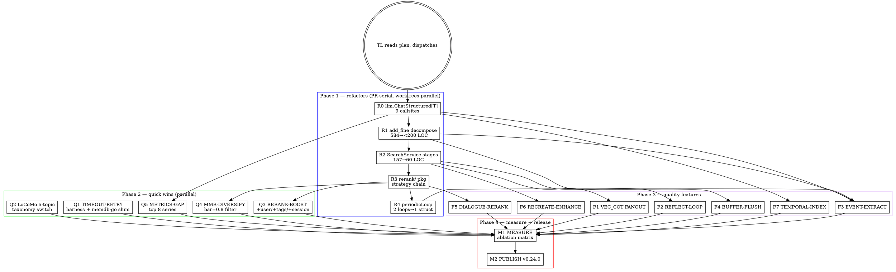

# M11 — LoCoMo Leadership: VEC_COT, Events, Refactor

> **Mission:** ship MemDB **≥ 76.0% LLM Judge** (excl cat-5) on LoCoMo chat-50 stratified, putting us **at or above Memobase 75.78% public leaderboard**, with a clean codebase that supports M12 multimodal + agent integrations. Headline target: **+3.5pp over v0.23.0 (72.5% → 76.0%)**, with ablation evidence per stream.
>
> **Foundation:** v0.23.0 (M10) shipped user_profiles, CE precompute, PageRank, reward-loop scaffold, helm chart, 5 audit fixes. Position: between MemOS (73.31%) and Zep (75.14%), -3.28pp from Memobase. M11 closes the gap by porting the **last three structural patterns** (VEC_COT fanout, Reflection-loop deep search, event extraction) and decomposing four pain-point hot files so M12 ships fast.
>
> **Controller (TL):** coordinator + dispatcher + merger. Writes no code. Banked rule: subagents stop at `gh pr create`; merging is controller-only. Worktree isolation mandatory for parallel implementer streams.
>
> **Inputs that drive this plan:**
> - **cat-2 diagnostic** (analyzed 2026-04-27): cat-2 multi-hop is 76% temporal "When..." Q; full-corpus hit@k 35% — 50% of cat-2 fails are recall-bound. VEC_COT is bullseye but must be **temporal-aware**.
> - **Infrastructure leak**: 7% corpus (140 Q) lost to /search 503/timeout. cat-4 alone bleeds 74 Q. Fix → +3-4pp headline at S effort.
> - **Wrong taxonomy**: M10 ported Memobase **default 8-topic** taxonomy, but the LoCoMo benchmark fixture (`docs/experiments/locomo-benchmark/src/memobase_client/config.yaml`) uses a **different 5-topic** taxonomy (`basic_info, personal_narrative, life_circumstances, personal_growth, plans`). Memobase's 75.78% headline runs on the 5-topic version.
> - **Code health**: `nativeFineAddForCube` is 584 LOC / cyc 18 / 11-param sigs; `SearchService.Search` is 157 LOC / cyc 19; 8 ad-hoc HTTP clients in `internal/search/` duplicate `internal/llm.Client.Chat`. M11 quality features (events, buffer, reflection) require these splits as prerequisites — no new mega-functions.

---

## 0. Team composition

| Agent | Role | Model | Scope | Boundary |
|-------|------|-------|-------|----------|
| **TL** | Controller | Opus 4.7 (1M ctx) | Plan, Agent, Bash, gh | All coordination + merges; never writes code |
| **R0 LLM-CLIENT** | Refactor — `llm.ChatStructured[T]` | Opus | `internal/llm/parse.go` (NEW) + 9 callsite migrations | Refactor only — no behavior change; coverage parity |
| **R1 ADD-PIPELINE** | Refactor — decompose `nativeFineAddForCube` | Opus | `internal/handlers/add_fine{,_candidates,_actions,_async}.go` | Splits 584-LOC file into ≤200-LOC siblings; tests must stay green |
| **R2 SEARCH-PIPELINE** | Refactor — `SearchService.Search` → stages | Opus | `internal/search/{service,pipeline,pipeline_*}.go` | `Search` becomes ≤60-LOC orchestrator; per-stage timing metrics included |
| **R3 RERANK-STRATEGY** | Refactor — extract `internal/search/rerank/` pkg | Sonnet | `internal/search/rerank/{strategy,cosine,ce,llm,staged}.go` (NEW) | 3 rerank touchpoints → 1 strategy chain |
| **R4 SCHED-LOOPS** | Refactor — extract `periodicLoop` primitive | Sonnet | `internal/scheduler/loops.go` (NEW) + pagerank/periodic_reorg migration | 2 background loops → 1 struct |
| **Q1 TIMEOUT-RETRY** | Quick win — harness retry on 503/timeout | Sonnet | `evaluation/locomo/{query,run}.py` + memdb-go HTTP retry shim | Re-run lost 140 Q; expected +3-4pp |
| **Q2 LOCOMO-TAXONOMY** | Quick win — switch profile prompt to 5-topic | Sonnet | `internal/llm/profile_prompts.go` const string + ablation flag | Both taxonomies compilable behind env `MEMDB_PROFILE_TAXONOMY=default\|locomo` |
| **Q3 RERANK-BOOST** | Quick win — `+user_id +tags +session_id` boost | Sonnet | `internal/search/rerank/ce.go` (post-R3) | MemOS http_bge.py `_apply_boost_generic` parity |
| **Q4 MMR-DIVERSIFY** | Quick win — bar=0.8 redundancy filter | Sonnet | `internal/search/rerank/mmr.go` (NEW post-R3) | MemOS `find_best_unrelated_subgroup` port |
| **Q5 METRICS-GAP** | Quick win — top-8 missing Prometheus metrics | Sonnet | distributed across 8 files (cache, add_fine stages, rerank, embedder retry, scheduler) | All series pre-registered at zero |
| **F1 VEC-COT** | Feature — sub-question fanout retrieval | Opus | `internal/search/vec_cot_fanout.go` (NEW) + `cot_decomposer.go` extension | MemOS `searcher.py:_retrieve_paths` Path-B port |
| **F2 REFLECT-LOOP** | Feature — DeepSearch reflection agent | Opus | `internal/search/reflection_agent.go` (NEW) + iterative_retrieval extension | `{sufficient/needs_raw/missing_info}` JSON termination |
| **F3 EVENT-EXTRACT** | Feature — Memobase entry_summary + event extraction | Opus | `internal/llm/event_extractor.go` (NEW) + `internal/db/postgres_events.go` (NEW) + migration `0019_user_events.sql` | Two parallel LLM calls per blob (profile + event); time-anchored memo log |
| **F4 BUFFER-FLUSH** | Feature — 1024-token buffer + Redis lock | Opus | `internal/handlers/add_buffer.go` (NEW post-R1) + scheduler hook | Memobase `flush_buffer_by_ids` parity; 5-10× LLM call reduction |
| **F5 DIALOGUE-RERANK** | Feature — dialogue-pair rerank strategy | Sonnet | `internal/search/rerank/dialogue.go` (NEW post-R3) | MemOS `single_turn.py` + `singleturn_outmem.py` port |
| **F6 RECREATE-ENHANCE** | Feature — MEMORY_RECREATE_ENHANCEMENT step | Sonnet | `internal/search/answer_enhance.go` extension | MemOS `advanced_search_prompts.py:165` port |
| **F7 TEMPORAL-INDEX** | Feature — first-class event_dates index | Opus | `internal/llm/extractor.go` event_dates field + GIN index in migration `0020_event_dates.sql` + retrieval boost | Targets 76% temporal cat-2 Q; M11 cat-2 lever |
| **M1 MEASURE** | Eval — full-corpus Stage 4 v1 + ablation matrix | Sonnet | `evaluation/locomo/results/m11-*` | Per-stream lift attribution; ablation A→Z |
| **M2 PUBLISH** | Release — v0.24.0 | Sonnet | `CHANGELOG.md` + release notes + GH release | After all measure passes |
| **REVIEW (×2)** | Spec + code quality reviewers per PR | Sonnet (spec) / Opus (quality) | go-code MCP | Two-stage review on every PR; never skip |

> TL = single point of merge to `main`. Subagents stop at `gh pr create`. **Two implementers must NEVER share a checkout** — use `git worktree add` (Agent `isolation: "worktree"`) for any parallel-eligible phase.

---

## 1. Strategic frame

### Diagnosis (cat-2 jq analysis 2026-04-27)

| Cat | n | acc | hit@k | recall-fail | gen-fail | lucky | bottleneck |
|---|---|---|---|---|---|---|---|
| 1 single-hop | 282 | 53% | 74% | 19% | 26% | 11% | gen-bound |
| **2 multi-hop** | **321** | **28%** | **35%** | **50%** | 20% | 48% | **recall-bound (76% temporal "When...")** |
| 3 open-domain | 96 | 37% | 60% | 29% | 33% | 27% | balanced |
| 4 temporal | 841 | 59% | 80% | 14% | 25% | 7% | gen-bound (best) |
| 5 adversarial | 446 | 10% | 71% | 26% | 63% | 23% | excluded |

**Key insight:** cat-2 LoCoMo questions are not graph multi-hop — they are temporal multi-hop ("When did X happen across multiple sessions"). Generic VEC_COT helps but a **temporal-key index** + entry-summary time-anchoring (Memobase pattern) is the dominant lever.

Errors by category:
- 140 timeouts/500s (7% corpus). cat-4 alone: 74 Q. Headline upper bound from Q1 alone: **+3.4pp** (50% retry success) to **+4.7pp** (70%).

### Where the 3.5pp comes from (target = 76.0%)

| Stream | Expected lift (excl cat-5) | Confidence | Bound by |
|--------|----------------------------|------------|----------|
| Q1 timeout retry | +3.0–3.5 pp | high | infra fix only; ceiling = 50% retry recovery |
| Q2 LoCoMo 5-topic taxonomy | +0.5–1.0 pp | medium | const string + ablation; size of profile recall delta |
| F1 VEC_COT fanout | +1.0–2.0 pp | medium | helps cat-2 recall; capped because cat-2 is mostly temporal |
| F2 Reflection-loop | +0.5–1.5 pp | medium | depends on iteration budget tuning |
| F3 Event extraction + entry_summary | +1.0–2.0 pp | high | second-largest known structural gap to Memobase |
| F7 Temporal-index (cat-2 specific) | +1.0–1.5 pp | high | targets the 76% temporal cat-2 |
| Q3+Q4+F5+F6 (rerank suite) | +0.5–1.0 pp | medium | cumulative rerank polish |

**Compound expectation:** features overlap. Plan budgets **aggregate +3.5pp** (from 72.5% to 76.0%) with stretch +5pp if event extraction lifts cat-1/cat-2/cat-4 simultaneously. Compound rule from M7: small individually-validated gains stack threshold-gated by data density.

### Why now
- M10 closed the user_profiles structural moat; remaining gap = retrieval (cat-2) + event semantics (cat-1/2/4).
- v0.23.0 is published on Show HN / leaderboard updates. "Within 0.81pp of MemOS, 3.28pp of Memobase" makes a stronger Show HN narrative than "leader" before VEC_COT lands.
- M12 features (multimodal, agent integrations) need the refactored search pipeline + add pipeline + LLM client. R0–R4 unblock M12 mechanically, regardless of M11 LoCoMo numbers.

---

## 2. High-level orchestration

**Phase ordering rationale:**
- **Phase 1 first** — no new mega-functions on top of `nativeFineAddForCube` (already 584 LOC). Refactors land in PR-serial order (R0 → R1 → R2 → R3 → R4) but each one runs in its own worktree concurrently with the *previous* one's review.
- **Phase 2 parallel** — once R0+R3 are merged, all five Q-streams operate on disjoint files and can run in 5 parallel worktrees.
- **Phase 3 mostly parallel** — F1/F2/F6 share `internal/search/` after R2 split; F3/F4 share `internal/handlers/` after R1 split; F5 lives in `internal/search/rerank/` after R3; F7 spans extractor + DB + retrieval. Two-at-a-time per package, worktree-isolated.
- **Phase 4 serial** — M1 ablation must complete before M2 publish.

---

## 3. Per-stream specifications

> **Universal preflight (all streams):** branch off `main`, never push to `main` directly, PR + assign TL as reviewer, two-stage review (spec + quality), no `gh pr merge` from subagents.
>
> **Universal acceptance:** `make lint`, `make test`, `golangci-lint run` clean; new code under file-size cap (≤200 LOC target, ≤300 hard); no func >100 LOC / cyc >15 / 4+ params; metrics for new behaviors.

---

### Phase 1 — Refactors (must merge before Phase 2/3 dependents)

#### R0 — `llm.ChatStructured[T]` generic helper

- **Branch:** `refactor/r0-llm-chat-structured`
- **Owner:** Opus subagent
- **Scope (NEW):** `internal/llm/parse.go` — `func ChatStructured[T any](ctx, c *Client, msgs []Message, target *T, opts ...Opt) error` that owns: `Chat` → `StripJSONFence` → `json.Unmarshal` → optional retry-once-with-format-reminder → metric. Add `Opt` knobs for `WithMaxRetries`, `WithSchemaHint`, `WithFenceLanguages`.
- **Migrations:** 9 ad-hoc HTTP callers must move to `ChatStructured`:
  - `internal/search/staged_retrieval.go::callStagedLLM` (52 LOC)
  - `internal/search/query_rewrite.go::callRewriteLLM` (60 LOC)
  - `internal/search/cot_decomposer.go::callLLM` (54 LOC)
  - `internal/search/query_decompose.go:171`
  - `internal/search/iterative_retrieval.go:265`
  - `internal/search/enhance.go:166`
  - `internal/search/answer_enhance.go:165`
  - `internal/search/fine.go::callLLMForJSON` (cyc 8)
  - `internal/search/llm_rerank.go::rerankHTTPCall` (62 LOC)
  - `internal/scheduler/profiler.go:176` (10th, also bypasses the client)
- **Acceptance:**
  1. All 10 callsites use `llm.ChatStructured`. Total LOC reduction ≥ 250.
  2. `internal/llm/parse_test.go` covers fence, retry-on-bad-json, retry-on-429.
  3. New metric `memdb.llm.structured_call_total{prompt_id,outcome}` and `memdb.llm.structured_duration_ms{prompt_id}` registered.
  4. `prompt_id` is a string label set by the caller (e.g. `"d4_rewrite"`, `"d10_enhance"`, `"profile_extract"`). At least 10 distinct labels live after migration.
  5. Behavior parity validated: re-run a 3-conv LoCoMo subset and assert F1 within ±0.005 of pre-refactor baseline.
- **Risk:** medium — 10 callsites, all locally testable.
- **Unblocks:** Q5 (metrics), F3, F7 (new prompts).

#### R1 — Decompose `nativeFineAddForCube` (584 LOC, cyc 18)

- **Branch:** `refactor/r1-add-fine-decompose`
- **Owner:** Opus subagent
- **Scope:**
  - `internal/handlers/add_fine.go` — keep ≤80 LOC, top function is the orchestrator only.
  - `internal/handlers/add_fine_candidates.go` (NEW) — `fetchFineCandidates` + tier helpers.
  - `internal/handlers/add_fine_actions.go` (NEW) — `applyFineActions`, `applyDelete/Update`, build helpers. The 9-/10-/11-param signatures collapse to `factContext` struct (passed by value).
  - `internal/handlers/add_fine_async.go` (NEW) — 5 background-trigger methods behind `triggerBackgroundExtractors(ctx, cubeID, conv, ...)` single entrypoint.
- **Acceptance:**
  1. Each new file ≤200 LOC; `add_fine.go` ≤80 LOC.
  2. No function >100 LOC, cyc ≤15, params ≤4 (use struct).
  3. Behavior parity: livepg test pack passes; LoCoMo 3-conv subset within ±0.005 F1.
  4. New metric `memdb.add.stage_duration_ms{stage=classify|extract|embed|apply|fanout}` (5 stages).
- **Risk:** high blast radius (3 callers + 9 livepg tests). Worktree isolation mandatory.
- **Unblocks:** F3, F4.

#### R2 — `SearchService.Search` → `[]stage` pipeline

- **Branch:** `refactor/r2-search-pipeline-stages`
- **Owner:** Opus subagent
- **Scope:**
  - `internal/search/service.go` — keep ≤60 LOC entrypoint; `Search` builds `[]stage` and runs.
  - `internal/search/pipeline.go` (NEW) — `type stage interface { Name() string; Run(ctx, *state) error }`; `runPipeline(ctx, []stage, *state)` with timing + per-stage metric emission.
  - `internal/search/pipeline_query.go` (NEW) — D4 rewrite + D7/D11 CoT decompose stages.
  - `internal/search/pipeline_multihop.go` (NEW) — D2 graph expand + BFS stage.
  - `internal/search/pipeline_finalize.go` (NEW) — profile inject, post-process, retrieval-count async.
- **Acceptance:**
  1. `Search` ≤60 LOC, cyc ≤8.
  2. The 14 hardcoded `time.Since(...)` durations replaced by `state.timings map[string]time.Duration`, populated by `runPipeline`.
  3. Per-stage metric `memdb.search.stage_duration_ms{stage}` emitted automatically for every stage.
  4. Stage order remains identical for parity (validated via LoCoMo 3-conv subset, F1 within ±0.005).
  5. `feature_flags.go` (NEW or extended) controls per-stage gating: `MEMDB_DISABLE_BFS_AFTER_COT=true` works as a feature flag without orchestrator change.
- **Risk:** medium-high (9 tests cover Search). Worktree.
- **Unblocks:** F1, F2, F6.

#### R3 — Extract `internal/search/rerank/` strategy package

- **Branch:** `refactor/r3-rerank-strategy-pkg`
- **Owner:** Sonnet subagent
- **Scope:**
  - `internal/search/rerank/strategy.go` (NEW) — `type Reranker interface { Rerank(ctx, query, []Item) []Item; Name() string }`; chain wrapper.
  - `internal/search/rerank/cosine.go` (NEW) — port of `rerank.go` cosine + temporal decay.
  - `internal/search/rerank/ce.go` (NEW) — port of `cross_encoder_adapter.go` + precompute lookup.
  - `internal/search/rerank/llm.go` (NEW) — port of `llm_rerank.go`.
  - `internal/search/rerank/staged.go` (NEW) — port of `staged_retrieval.go`'s rerank step.
  - `internal/search/postprocess.go` modified — replaces 5 inline rerank branches with `rerank.Chain([]Reranker{...}).Rerank(...)`.
  - **Single contract:** only `Reranker.Rerank` mutates `metadata.relativity` and `metadata.<flag>_reranked`. Prevents the current 5-site contention.
- **Acceptance:**
  1. `metadata.relativity` mutation site count drops from 5 to 1 (verified by `go-code code_search`).
  2. Per-strategy metric `memdb.search.rerank_strategy_total{name,outcome}`.
  3. LoCoMo 3-conv subset F1 parity ±0.005.
- **Risk:** medium (1 caller `postProcessResults`).
- **Unblocks:** Q3, Q4, F5.

#### R4 — Extract `periodicLoop` primitive

- **Branch:** `refactor/r4-scheduler-loops`
- **Owner:** Sonnet subagent
- **Scope:**
  - `internal/scheduler/loops.go` (NEW) — `type periodicLoop struct{ name string; interval, stagger time.Duration; lockKey string; run func(ctx) error }` + `Start(ctx)`.
  - `internal/scheduler/pagerank.go` — `runPageRankLoop` reduces to a `periodicLoop{...}.Start(ctx)` call.
  - `internal/scheduler/worker_periodic.go` — `periodicReorgLoop` likewise.
- **Acceptance:**
  1. Both existing loops compile and run under the new primitive.
  2. New metric `memdb.scheduler.loop_iterations_total{name,outcome}` and `memdb.scheduler.loop_duration_ms{name}` for any future loop.
  3. Behavior parity: PageRank advisory-lock skip path still observable via `outcome=skipped_other_leader`.
- **Risk:** low (1 caller each).
- **Unblocks:** F3 (event-extraction background re-summarizer needs a loop), future M12 profile-refresh loop.

---

### Phase 2 — Quick wins (parallel, post-Phase-1)

#### Q1 — Timeout retry on /search and /chat/complete

- **Branch:** `feat/q1-locomo-timeout-retry`
- **Owner:** Sonnet subagent
- **Scope:**
  - `evaluation/locomo/query.py` — add `--retry-on-timeout` (default 2 attempts, exp backoff 5s/15s) for HTTP 5xx and connection timeout.
  - Optional: memdb-go side, raise `/product/search` request timeout from default to 90s for cube_id with > 1k memories (`internal/handlers/search.go` server.go middleware tweak).
- **Acceptance:**
  1. Re-run the 140 failed Q from `m10-stage4-final.json`. ≥ 70 of them produce a non-error response on retry.
  2. Headline excl-cat-5 LLM Judge gain ≥ +3.0pp on the 140-Q subset re-eval.
  3. New metric `memdb_locomo_retry_total{cat,attempt,outcome}` in the harness.
- **Risk:** low. Bounded by harness changes.
- **Lift:** **+3.0–3.5pp** (highest single stream).

#### Q2 — LoCoMo 5-topic taxonomy switch

- **Branch:** `feat/q2-locomo-taxonomy`
- **Owner:** Sonnet subagent
- **Scope:**
  - `internal/llm/profile_prompts.go` — add `profileTopicGuidelinesLocomo` const mirroring `docs/experiments/locomo-benchmark/src/memobase_client/config.yaml` (`basic_info, personal_narrative, life_circumstances, personal_growth, plans`).
  - `internal/llm/profile_extractor.go` — switch on env `MEMDB_PROFILE_TAXONOMY=default|locomo|assistant|companion|education` (default = `locomo` for LoCoMo eval, `default` for prod).
  - `internal/config/profile_personas.go` (NEW) — registry of all 5 persona configs from Memobase upstream.
  - Smoke test: re-extract on 1 conv, assert ≥3 of the 5 topics produced.
- **Acceptance:**
  1. Both taxonomies compilable and selected by env.
  2. Topic taxonomy switch logged on startup (`profile_taxonomy=locomo`).
  3. Ablation in M1 measures each taxonomy independently.
- **Risk:** low. Const string + env switch.
- **Lift:** **+0.5–1.0pp** (M10 may have used wrong taxonomy on the leaderboard run — this is the suspected gap).

#### Q3 — Rerank metadata boost (`+user_id, +tags, +session_id`)

- **Branch:** `feat/q3-rerank-metadata-boost`
- **Owner:** Sonnet subagent
- **Depends on:** R3 merged.
- **Scope:** `internal/search/rerank/ce.go` — port MemOS `_apply_boost_generic` (http_bge.py:287-324). Coefficients env-tunable: `MEMDB_RERANK_BOOST_USER_ID=0.5`, `MEMDB_RERANK_BOOST_TAGS=0.2`, `MEMDB_RERANK_BOOST_SESSION_ID=0.3`.
- **Acceptance:** unit test for boost arithmetic; LoCoMo 3-conv subset ablation showing non-zero delta.
- **Lift:** +0.2–0.5pp.

#### Q4 — MMR diversification (bar=0.8)

- **Branch:** `feat/q4-mmr-diversify`
- **Owner:** Sonnet subagent
- **Depends on:** R3 merged.
- **Scope:** `internal/search/rerank/mmr.go` (NEW) — port MemOS `find_best_unrelated_subgroup` (retrieve_utils.py:450-465). Greedy: keep memory if cosine to all kept ≤ 0.8.
- **Acceptance:** placed AFTER CE rerank, BEFORE final top-K cut. Ablation in M1.
- **Lift:** +0.2–0.5pp.

#### Q5 — Top-8 missing Prometheus metrics

- **Branch:** `feat/q5-metrics-coverage`
- **Owner:** Sonnet subagent
- **Depends on:** R0 merged (uses `llm.ChatStructured` metrics seam) + R1 merged (per-stage histograms).
- **Scope (all in respective files):**
  1. `memdb.cache.hits_total{route}` + `misses_total{route}` — `internal/server/middleware/cache.go:111,114`.
  2. `memdb.add.stage_duration_ms{stage}` — emitted automatically by R1 split.
  3. `memdb.search.d1_boost_magnitude` (Float64Histogram) — `internal/search/rerank.go:265`.
  4. `memdb.embedder.retry_total{reason}` — `internal/embedder/retry.go:60`.
  5. `memdb.add.profile_facts_extracted` (Int64Histogram, buckets 0,1,3,5,10,20) — `internal/handlers/add_fine_profile.go:190`.
  6. `memdb.search.d5_stage_input_size{stage}` — `internal/search/staged_retrieval.go:92` (or post-R2 stage hook).
  7. `memdb.scheduler.d3_cluster_size{tier=episodic|semantic}` — `internal/scheduler/tree_manager.go:105,167`.
  8. `memdb.feedback.extract_examples_written_total` — `internal/db/postgres_feedback.go:88`.
- **Acceptance:** all 8 series queryable via Prometheus on a live test instance; alert rules added for `memdb_cache_hit_ratio < 0.3` and `memdb_embedder_retry_total[5m] > 50`.
- **Lift:** 0pp directly; debugging value for M1 + M2.

---

### Phase 3 — Quality features

#### F1 — VEC_COT sub-question fanout

- **Branch:** `feat/f1-vec-cot-fanout`
- **Owner:** Opus subagent
- **Depends on:** R2 merged.
- **Scope:**
  - `internal/search/vec_cot_fanout.go` (NEW) — port of MemOS `searcher.py:_retrieve_paths` Path-B (lines 330-468). Steps:
    1. Call existing `cot_decomposer.go::Decompose` to get up to 3 sub-Qs (already there since D11).
    2. Batch-embed all sub-Qs in one HTTP call to embed-server.
    3. **Prepend the original query embedding** to the sub-Q embedding list (MemOS pattern).
    4. Run `memdb-go/internal/db/queries.SearchByVectors([]embedding)` against pgvector with each, collecting ID-keyed map of max scores.
    5. Final rerank uses **only the original query embedding** through the existing CE chain.
  - `internal/search/pipeline_query.go` — gate Path-B as a stage when `MEMDB_VEC_COT=true` AND query passes a complexity heuristic (>5 tokens, contains "and"/"or"/"both"/"all", or D11 marks as complex).
  - **Temporal-aware sub-question prompt** — adapt MemOS `SIMPLE_COT_PROMPT` (mem_search_prompts.py:1-93) to add: "If the query asks about a date or time period, ensure each sub-question retains the temporal anchor." This addresses the cat-2 "When..." dominance.
- **Acceptance:**
  1. Sub-Q fanout returns ≤3 sub-Qs in 90% of complex-flagged queries.
  2. New metric `memdb.search.vec_cot_subquery_count{outcome}` + histogram of fanout latency.
  3. Ablation: cat-2 hit@k full-corpus rises from 35% → ≥45% (target +10pp on hit@k for cat-2).
  4. Headline LoCoMo lift ≥ +1.0pp excl cat-5.
- **Risk:** medium. Needs careful per-stage caching to avoid 4× LLM calls per query.
- **Lift:** +1.0–2.0pp.

#### F2 — Reflection-loop deep search

- **Branch:** `feat/f2-reflection-loop`
- **Owner:** Opus subagent
- **Depends on:** R0 + R2 merged.
- **Scope:**
  - `internal/search/reflection_agent.go` (NEW) — port of MemOS `mem_agent/deepsearch_agent.py` lines 60-223.
  - Loop: query → search → reflect (LLM, structured JSON `{status: "sufficient"|"needs_raw"|"missing_info", missing_entities: [...], new_search_query: "..."}`) → branch.
  - `needs_raw` branch: re-fetch source dialogue for current top-K (uses our existing source-attached memories from D8/D9).
  - `missing_info` branch: re-run search with `new_search_query`.
  - `sufficient` branch: stop and pass top-K to D10 enhancement.
  - `MEMDB_REFLECTION_MAX_ITER=3` (default 2 to budget LLM cost).
- **Acceptance:**
  1. New metric `memdb.search.reflection_iter{outcome=sufficient|needs_raw|missing_info|max_iter}`.
  2. Latency budget: p95 chat with reflection on ≤ 4× p95 without reflection (gated path).
  3. Ablation: cat-2 acc rises ≥ +1pp, cat-3 acc rises ≥ +1.5pp.
- **Lift:** +1.0–1.5pp.

#### F3 — Memobase event extraction + entry_summary

- **Branch:** `feat/f3-event-extract`
- **Owner:** Opus subagent
- **Depends on:** R0 + R1 + R4 merged.
- **Scope:**
  - `migrations/0019_user_events.sql` — table `user_events` (cube_id, event_tip TEXT, tags JSONB, profile_delta JSONB, observed_at TIMESTAMPTZ, embedded_vec VECTOR(1024), created_at). Cube-scoped index. Relation edge `RELATED_EVENT` between `Memory` and event row.
  - `internal/llm/event_extractor.go` (NEW) — single LLM call producing `{event_tip, event_tags, profile_delta}` per blob. Prompt port of Memobase `prompts/event_tagging.py` + `prompts/summary_entry_chats.py` with `[mention YYYY/MM/DD]` time-anchor preservation.
  - `internal/db/postgres_events.go` (NEW) — `InsertEvent`, `SearchEventsByDate(cubeID, dateRange)`, `SearchEventsByTag`, `SearchEventsByCosine`.
  - `internal/handlers/add_fine_async.go` — wire event extraction as a 6th background extractor (parallel to profile, episodic, skill, tool, structured-profile). Bounded by R1's `triggerBackgroundExtractors` semaphore (admission-controlled).
  - `internal/search/pipeline_finalize.go` — event-context injection: when query is temporal, retrieve top-3 events and inject into chat prompt above memory section.
- **Acceptance:**
  1. ≥ 3 events extracted per LoCoMo conversation on average.
  2. cat-1, cat-2, cat-4 LLM Judge each rises by ≥ +1pp in ablation.
  3. New metric `memdb.add.event_extracted_total{outcome}` + `memdb.search.event_inject_total{cat}`.
  4. p99 add latency unchanged (background extractor; no sync blocker).
- **Lift:** +1.0–2.0pp (likely highest-leverage feature).

#### F4 — Buffer-driven flush

- **Branch:** `feat/f4-buffer-flush`
- **Owner:** Opus subagent
- **Depends on:** R1 + R4 merged.
- **Scope:**
  - `internal/handlers/add_buffer.go` (NEW) — buffer entry that writes to `memdb:user_buffer:<cube_id>` Redis list and returns 202.
  - `internal/scheduler/buffer_flusher.go` (NEW) — `periodicLoop` (interval 30s) that picks up cubes with > 1024 buffered tokens OR last-flush > 10min, acquires Redis lock `memdb:user_lock:<cube_id>` (Memobase parity), drains buffer, calls `nativeFineAddForCube` once with the merged blob batch.
  - `migrations/0021_buffer_zone.sql` — `buffer_zone` table mirroring Memobase schema (statuses idle/processing/done/failed) for durable retry across restarts.
  - Env: `MEMDB_BUFFER_FLUSH_TOKENS=1024`, `MEMDB_BUFFER_FLUSH_AGE_SECONDS=600`, `MEMDB_BUFFER_MAX_PROCESS_TOKENS=16384`.
  - Optional flag: `add_fine` keeps sync path; new endpoint `/product/add_buffer` provides batched path. Caller chooses.
- **Acceptance:**
  1. LLM extract calls per `/product/add_buffer` cube reduced by ≥ 5× vs `/product/add_fine` on a 50-message synthetic stream (the same conversation should hit ≥5× fewer extract LLM calls).
  2. Flush latency p95 ≤ 8s for batches of ≤ 16k tokens.
  3. New metrics: `memdb.buffer.queued_tokens` (gauge), `memdb.buffer.flush_total{outcome}`, `memdb.buffer.flush_duration_ms`.
  4. End-to-end: LoCoMo 1-conv test using buffer endpoint produces extract output with ≥0.95 IoU vs sync path (no information loss).
- **Lift:** +0.5–1.0pp (better extract context from full conversation slice; main win is cost/latency).

#### F5 — Dialogue-pair rerank strategy

- **Branch:** `feat/f5-dialogue-rerank`
- **Owner:** Sonnet subagent
- **Depends on:** R3 merged.
- **Scope:** `internal/search/rerank/dialogue.go` (NEW). Port of MemOS `single_turn.py:11-107` + `singleturn_outmem.py`. Each memory exploded to user/assistant pairs → CE-reranked → max-aggregate per memory id.
- **Acceptance:** ablation isolates strategy benefit; per-strategy metric.
- **Lift:** +0.5–1.0pp.

#### F6 — MEMORY_RECREATE_ENHANCEMENT step

- **Branch:** `feat/f6-recreate-enhance`
- **Owner:** Sonnet subagent
- **Depends on:** R0 + R2 merged.
- **Scope:** `internal/search/answer_enhance.go` extension. Port of MemOS `advanced_search_prompts.py:165` (MEMORY_RECREATE_ENHANCEMENT_PROMPT) + advanced_searcher.py:193. After D10's synthetic answer, optionally **rewrites** the top-3 retrieved memories to better align with the query (stored ephemerally for the chat turn, NOT written back). Gated by `MEMDB_RECREATE_ENHANCE=true`.
- **Acceptance:** ablation isolates lift; metric `memdb.search.recreate_enhance_total{outcome}`.
- **Lift:** +0.3–1.0pp.

#### F7 — Temporal-index (event_dates first-class)

- **Branch:** `feat/f7-temporal-index`
- **Owner:** Opus subagent
- **Depends on:** R0 merged.
- **Scope:**
  - `internal/llm/extractor.go` — extract LLM prompt requires JSON field `event_dates: [ISO8601]` for any temporal claim; falls back to empty array if not temporal.
  - `migrations/0020_event_dates.sql` — GIN index on `Memory.properties->'event_dates'`. Backfill job for existing rows.
  - `internal/search/pipeline_finalize.go` — when query embedding cosine-matches a temporal pattern (regex `\bwhen|on what (date|day)|in (january|february...)\b`), augment top-K with date-range search via `event_dates`.
  - `internal/search/temporal_match.go` (NEW) — date-range search helper.
- **Acceptance:**
  1. ≥ 50% of cat-4 LoCoMo memories carry a non-empty `event_dates`.
  2. cat-2 hit@k full-corpus rises from 35% → ≥ 50% (this stream is our primary cat-2 lever).
  3. cat-2 LLM Judge full-corpus rises from 29% → ≥ 40%.
- **Lift:** +1.0–1.5pp (highest cat-2-specific impact).

---

### Phase 4 — Measure + Release

#### M1 — Full-corpus measure + ablation matrix

- **Branch:** `eval/m1-stage5-locomo`
- **Owner:** Sonnet subagent
- **Scope:**
  - `evaluation/locomo/results/m11-stage5-final.json` — full 1986 QAs end-to-end with all M11 streams enabled.
  - `evaluation/locomo/results/m11-ablation-matrix.json` — for each {Q1, Q2, Q3, Q4, F1, F2, F3, F4, F5, F6, F7}, run with stream **disabled** (env flag) and record delta vs full-stack. Produces a per-stream attribution table.
  - `evaluation/locomo/MILESTONES.md` — append M11 section, per-cat breakdown, vs leaderboard.
- **Acceptance:**
  1. Headline ≥ 76.0% LLM Judge excl cat-5 chat-50 stratified.
  2. cat-2 LLM Judge full-corpus ≥ 40% (up from 29%).
  3. cat-2 hit@k full-corpus ≥ 50% (up from 35%).
  4. timeout count ≤ 30 (down from 140).
  5. Ablation matrix sums coherently: each row's `(disabled - full_stack)` is negative-or-zero with ≤ 0.5pp jitter.
- **Risk:** the budget is 11 ablation runs × ~10h = 110h compute. Run on `--workers 4` parallel; budget 24h wall.

#### M2 — Publish v0.24.0

- **Branch:** `release/v0.24.0`
- **Owner:** Sonnet subagent
- **Scope:** CHANGELOG.md, `docs/release-notes/v0.24.0.md`, `ROADMAP.md` headline update, MILESTONES.md M11 section, GH release.
- **Acceptance:**
  1. release-drafter PR clean.
  2. Post-release: tag pushed, dozor auto-deploy fires, prod `/health` reports new build hash.
  3. README updated with new headline (76.0% or actual measured number).

---

## 4. Acceptance criteria (rollup)

| ID | Headline criterion |
|---|---|
| **M11.HEADLINE** | ≥ 76.0% LLM Judge (excl cat-5) on LoCoMo chat-50 stratified |
| **M11.CAT2** | cat-2 full-corpus LLM Judge ≥ 40% (up from 29%); hit@k ≥ 50% (up from 35%) |
| **M11.INFRA** | LoCoMo run timeout count ≤ 30 (down from 140) |
| **M11.CODE-HEALTH** | `nativeFineAddForCube` ≤ 80 LOC; `SearchService.Search` ≤ 60 LOC; ≤ 1 HTTP client outside `internal/llm/` |
| **M11.METRICS** | All 8 missing series live; alert rules in place for cache and embed retry |
| **M11.RELEASE** | v0.24.0 published with auto-changelog, tag pushed, dozor auto-deploy successful |

---

## 5. Risk register

| Risk | Likelihood | Impact | Mitigation |
|------|-----------|--------|------------|
| Refactor regression on `add_fine` (R1) | medium | high | Worktree + livepg test pack + 3-conv F1 parity gate |
| Two implementers stomp on `internal/search/` | low | high | Worktree-only; phase ordering enforces R2 lands before F1/F2/F6 |
| F3 event extraction doubles LLM cost without lift | low | medium | Behind `MEMDB_EVENT_EXTRACT=true`; ablation in M1 must show ≥1pp; revert if not |
| Q1 timeout retry hides a real perf regression | low | medium | Q1 also adds memdb-go server-side metric `memdb_search_timeout_total{cube_size_bucket}` so retries don't mask growth |
| LoCoMo taxonomy switch (Q2) drops cat-3 | low | medium | Ablation in M1 keeps both compilable; we pick winner per-cat |
| Compute budget for ablation matrix exceeds 24h | medium | low | M1 runs on `--workers 4` parallel; if blocked, prioritize headline + cat-2 only |
| 8 LLM-client migrations (R0) introduce subtle behavior change | medium | high | Coverage parity test; LoCoMo 3-conv subset gates each migration commit |

---

## 6. Out of scope (M11 → defer)

- **Implicit preference extraction** (MemOS `prefer_text_memory`) — defer to M12; cat-3 (open-domain, n=96) is small and uncertain.
- **Sparse vectors for preference search** (Phase 2 backlog) — Qdrant 1.16 already deployed but BM25 sparse encoder would be net-new infra; M12.
- **ColBERT/ONNX rerank** (Phase 8 backlog) — current CE precompute already covers query-time cost; ColBERT is M12 latency optimization.
- **Procedural memory** (Phase 10 backlog) — pattern detection from corrections; M12+.
- **Migration `0018` reaping NULL `cube_id` legacy rows** — XS, can land any time; folded into R1 if convenient.
- **Apps/Electron/OpenClaw** — not our market.

---

## 7. Branch + worktree convention

- All M11 branches are feature/refactor/eval/release branches off `main`.
- Worktree commands: `git worktree add ../memdb-m11-r0 -b refactor/r0-llm-chat-structured` etc.
- Each subagent prompt MUST include preflight: `git status --short` clean check; `git branch --show-current` not `main` check; `gh pr create` only — never `gh pr merge`.
- TL merges in PR-serial order: R0 → R1 → R2 → R3 → R4 → (Phase 2 parallel) → (Phase 3 parallel) → M1 → M2.

---

## 8. Two-stage review (per PR, never skip)

**Spec reviewer (Sonnet)** — verifies the PR matches its acceptance criteria. Output: PASS/REQUEST_CHANGES with bullet-by-bullet checklist.

**Quality reviewer (Opus)** — runs `go-code understand` on top-3 changed symbols; verifies no func >100 LOC, no cyc >15, no params >4, no new HTTP client outside `internal/llm/`. Output: PASS/REQUEST_CHANGES with concrete file:line refs.

TL merges only after both PASS.

---

## 9. Daily cadence

| Day | Phase | Streams in flight |
|-----|-------|-------------------|
| 1 | Phase 1 kick | R0 dispatched (worktree); R1 design discussion |
| 2 | Phase 1 cont | R0 PR + review; R1 dispatched |
| 3 | Phase 1 cont | R1 PR + review; R2 dispatched; R3+R4 design |
| 4 | Phase 1 close | R2 PR + review; R3+R4 dispatched in parallel worktrees |
| 5 | Phase 2 kick | Q1+Q2+Q5 dispatched in 3 parallel worktrees; Q3+Q4 await R3 merge |
| 6 | Phase 2 cont | Q1 PR (priority — biggest lift); Q3+Q4 dispatched |
| 7 | Phase 2 close | All Q PRs merged; F-streams design |
| 8 | Phase 3 kick | F3 + F7 dispatched (high-leverage); F1 design |
| 9 | Phase 3 cont | F1 + F2 dispatched; F3 PR + review |
| 10 | Phase 3 cont | F4 + F5 + F6 dispatched in worktrees |
| 11 | Phase 3 close | All F PRs merged |
| 12 | Phase 4 | M1 ablation runs (24h wall) |
| 13 | Phase 4 close | M1 results in MILESTONES.md; M2 dispatched |
| 14 | Release | v0.24.0 published; Show HN/X/Reddit |

Total: **2 weeks**, with Phase 1 the critical path. If Q1 alone meets +3pp, M11 already crosses 75.5% — close to leadership without F-streams. F-streams add the headroom and the M12 unblock.

---

## 10. References

- M9 plan: `docs/superpowers/plans/2026-04-26-m9-memobase-port-and-honest-measurement.md`
- M10 plan: `docs/superpowers/plans/2026-04-27-m10-user-profiles-and-perf.md`
- LoCoMo MILESTONES: `evaluation/locomo/MILESTONES.md` (M10 section, full per-cat breakdown)
- Memobase upstream: `/home/krolik/src/compete-research/memobase`
- MemOS upstream: `/home/krolik/src/compete-research/memos`
- Cat-2 jq diagnostic (this plan §1): `evaluation/locomo/results/m10-stage4-final.json`
- Memobase deep-dive (subagent report 2026-04-27): inline in this plan §3 F3 + Q2 derivation
- MemOS deep-dive (subagent report 2026-04-27): inline in this plan §3 F1 + F2 + F5 + F6 + Q3 + Q4 derivation
- Pain-point audit (subagent report 2026-04-27): inline in this plan §3 R0–R4 derivation
- Metrics gap audit (subagent report 2026-04-27): inline in this plan §3 Q5
